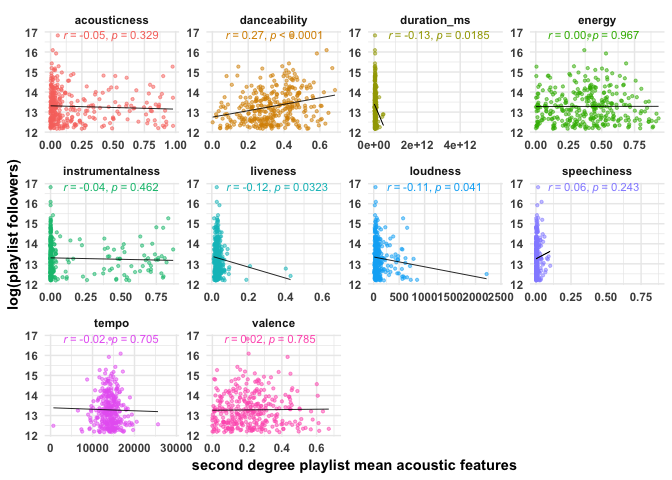

## Problem Statement

The goal of this is to project is to gain insight into

1. Key predictors that are influential in a playlist's success

~~2. Using the identified predictors, generate a playlist that is successful (metric measured in the # of followers)~~

In the [previous notebook](link), 92876 songs over 1541 playlists were retrieved from Spotify's featured playlists using their API. This was done using the spotifyr package and self-modified functions. The data consists of qualitative audio features pertaining to each track within a playlist, such as the key, mode, the artist genre, and quantitative features such as loudness, acousticness, valence, etc. 


## Introduction and Description of the Data

Using track level data, summary statistics were generated on the playlist level for quantitative audio features. All interactions and second-degree polynomials were also investigated and included in the final predictors. For categorical audio features (mode, key), factors were created corresponding to the majority vote, for example if a greater proportion of songs were in major than minor for a playlist, then the playlist would be considered primarily in major.

Features corresponding to highly occuring genres annd artists within the top 33% of playlists were also created.

It is possible that frequently occuring genres and artists within the top 33% of playlists (arbitrarily decided on), could contribute to the success of a playlist. Thus, the presence of the top 1% of artists and top 5% of genres were one-hot encoded on the playlist level as features. 

In total, 422 features were created. 


## Setup


## Helpers


```r
scttrCor <- function(...){
ggplot(...) +
  geom_point( alpha = 0.5, size = 0.8) +
  geom_smooth(formula = y~x, method = "lm", se = FALSE, size = 0.3, alpha = 0.5, colour = "black") + 
  stat_smooth_func(geom = "text", method = "lm", xpos = -Inf, ypos = Inf, hjust = -0.2, vjust = 1, parse = TRUE, size = 3) +
  theme(strip.text = element_text(face = "bold"),
        axis.text = element_text(face = "bold"),
        axis.title = element_text(face = "bold"))
}


histoPlot <- function(...){
  ggplot(...) + 
  geom_histogram() +
  theme(strip.text = element_text(face = "bold"),
        axis.text = element_text(face = "bold"),
        axis.title = element_text(face = "bold"))
}

boxJitterPlot <- function(...){
    ggplot(...) + 
    geom_jitter( width = 0.1,
                alpha = 0.5) + 
    geom_boxplot(width = 0.5, alpha = 0.8, colour = "black" ) + 
    stat_summary(fun.y = mean, geom = "errorbar", aes(ymax = ..y.., ymin = ..y..),
                 width = .75, linetype = "dashed", colour = "black") + 
  stat_summary(fun.y = mean, geom = "text", aes(label = round(..y.., 4)), vjust = -0.5, colour = "black") + 
  guides(fill = FALSE, colour = FALSE) 
}


quantile_tidy <- function(...){
  broom::tidy(quantile(...)) %>%
    arrange(desc(x)) %>%
    rename(percentile = names) %>%
    mutate(percentile = as.numeric(as.character(gsub("%", "", percentile))))
}

# for ggpairs 
corLine <- function(data, mapping, ...){
  p <- ggplot(data = data, mapping = mapping) + 
    geom_point(size = 0.2, alpha = 0.5) + 
    stat_smooth_func(geom = "text", method = "lm", xpos = -Inf, ypos = Inf, hjust = -0.2, vjust = 1, parse = TRUE, size = 2) +
  geom_smooth(formula = y~x, method = "lm", se = FALSE, size = 0.3, alpha = 0.5, colour = "black")
}
```


## The Data

```r
# Playlist Followers - the response
pl_info <- read_csv("data/raw/pl_info.csv", col_types = cols())
# Playlist Audio Features - the predictors
pl_audio_feats <- read_csv("data/raw/pl_audio_feats.csv", col_types = cols())
# Playlist Artist Featurs - the predictors
pl_artist_feats <- read_csv("data/raw/pl_artist_feats.csv", col_types = cols())
```

First, let's combine the three dataframes together.

```r
# Combining the data together using left join - 

pl_dat <- pl_info %>% 
  left_join(pl_audio_feats) %>% 
  left_join(pl_artist_feats)

glimpse(pl_dat)
```

```
## Observations: 92,876
## Variables: 28
## $ playlist_name       <chr> "Today's Top Hits", "Today's Top Hits", "T...
## $ playlist_uri        <chr> "37i9dQZF1DXcBWIGoYBM5M", "37i9dQZF1DXcBWI...
## $ playlist_followers  <int> 20284811, 20284811, 20284811, 20284811, 20...
## $ playlist_num_tracks <int> 50, 50, 50, 50, 50, 50, 50, 50, 50, 50, 50...
## $ track_name          <chr> "Girls Like You (feat. Cardi B)", "Jackie ...
## $ track_uri           <chr> "6FRLCMO5TUHTexlWo8ym1W", "4kWO6O1BUXcZmax...
## $ artist_name         <chr> "Maroon 5", "Tiësto", "Juice WRLD", "5 Sec...
## $ album_name          <chr> "Girls Like You (feat. Cardi B)", "Jackie ...
## $ track_added_at      <dttm> 2018-06-18 15:58:34, 2018-06-18 15:58:34,...
## $ track_popularity    <int> 92, 89, 78, 95, 92, 92, 86, 93, 94, 73, 10...
## $ danceability        <dbl> 0.851, 0.747, 0.437, 0.596, 0.601, 0.351, ...
## $ energy              <dbl> 0.541, 0.834, 0.481, 0.854, 0.724, 0.296, ...
## $ key                 <chr> "C", "D#", "B", "G", "F#", "E", "C#", "B",...
## $ loudness            <dbl> -6.825, -2.867, -9.681, -5.114, -4.856, -1...
## $ mode                <chr> "major", "minor", "minor", "minor", "major...
## $ speechiness         <dbl> 0.0505, 0.0450, 0.2370, 0.4630, 0.0486, 0....
## $ acousticness        <dbl> 0.5680, 0.3740, 0.3770, 0.0169, 0.0945, 0....
## $ instrumentalness    <dbl> 0.00e+00, 0.00e+00, 0.00e+00, 0.00e+00, 1....
## $ liveness            <dbl> 0.1300, 0.0586, 0.3300, 0.1240, 0.1200, 0....
## $ valence             <dbl> 0.448, 0.687, 0.216, 0.152, 0.508, 0.120, ...
## $ tempo               <dbl> 124.959, 128.005, 83.606, 120.274, 102.061...
## $ duration_ms         <dbl> 235545, 215760, 239947, 203418, 207905, 20...
## $ time_signature      <int> 4, 4, 4, 4, 4, 4, 4, 4, 4, 4, 4, 4, 4, 4, ...
## $ key_mode            <chr> "C major", "D# minor", "B minor", "G minor...
## $ artist_uri          <chr> "04gDigrS5kc9YWfZHwBETP", "2o5jDhtHVPhrJdv...
## $ artist_followers    <int> 11264168, 3201316, 270438, 3138366, 101580...
## $ artist_pop          <int> 89, 83, 86, 85, 88, 85, 83, 95, 85, 85, 10...
## $ artist_genres       <chr> "dance pop, pop", "big room, brostep, edm,...
```

```r
dim(pl_dat) # of songs
```

```
## [1] 92876    28
```

```r
pl_dat %>% distinct(playlist_name) # number of playlists
```

```
## # A tibble: 1,544 x 1
##    playlist_name     
##    <chr>             
##  1 Today's Top Hits  
##  2 RapCaviar         
##  3 mint              
##  4 Are & Be          
##  5 Rock This         
##  6 Hot Country       
##  7 ¡Viva Latino!     
##  8 New Music Friday  
##  9 Afternoon Acoustic
## 10 Peaceful Piano    
## # ... with 1,534 more rows
```

```r
pl_dat
```

```
## # A tibble: 92,876 x 28
##    playlist_name playlist_uri playlist_follow… playlist_num_tr… track_name
##    <chr>         <chr>                   <int>            <int> <chr>     
##  1 Today's Top … 37i9dQZF1DX…         20284811               50 Girls Lik…
##  2 Today's Top … 37i9dQZF1DX…         20284811               50 Jackie Ch…
##  3 Today's Top … 37i9dQZF1DX…         20284811               50 Lucid Dre…
##  4 Today's Top … 37i9dQZF1DX…         20284811               50 Youngblood
##  5 Today's Top … 37i9dQZF1DX…         20284811               50 Back To Y…
##  6 Today's Top … 37i9dQZF1DX…         20284811               50 lovely (w…
##  7 Today's Top … 37i9dQZF1DX…         20284811               50 Start Aga…
##  8 Today's Top … 37i9dQZF1DX…         20284811               50 All Mine  
##  9 Today's Top … 37i9dQZF1DX…         20284811               50 Solo (fea…
## 10 Today's Top … 37i9dQZF1DX…         20284811               50 Ocean (fe…
## # ... with 92,866 more rows, and 23 more variables: track_uri <chr>,
## #   artist_name <chr>, album_name <chr>, track_added_at <dttm>,
## #   track_popularity <int>, …
```

Investigate duplicate songs, playlists and playlists with no followers.

```r
# dropping unnecessary columns and ensuring all songs are unique

pl_dat <- pl_dat %>% 
  select(-contains("uri"), track_added_at) %>%
  distinct()

# checking to see if there are any 0 follower playlists
any(pl_dat$playlist_followers == 0)
```

```
## [1] FALSE
```

```r
# some playlists are duplicated, remove
pl_dat %>% distinct(playlist_name, playlist_followers) %>% count(playlist_name, sort = TRUE)
```

```
## # A tibble: 1,544 x 2
##    playlist_name             n
##    <chr>                 <int>
##  1 New Music Friday          3
##  2 Chill as Folk             2
##  3 Jukebox Joint             2
##  4 ¡Viva Latino!             1
##  5 '80s Rock Anthems         1
##  6 '90s Baby Makers          1
##  7 '90s Rock Renaissance     1
##  8 'Round Midnight           1
##  9 ’80s Hard Rock            1
## 10 ’80s Jam Session          1
## # ... with 1,534 more rows
```

```r
duplicated_playlists <- c("New Music Friday", "Chill as Folk", "Jukebox Joint")

pl_dat <- pl_dat %>% filter(!playlist_name %in% duplicated_playlists)

# will be used later to split our testing and training data again
write_csv(pl_dat, "data/clean_pl_eda_train.csv")

# pl_dat %>% filter(playlist_name %in% duplicated_playlists)
```

Next, we'll examine the number of missing values for each variable.

```r
miss_var_summary(pl_dat) %>% print(n = 30)
```

```
## # A tibble: 25 x 4
##    variable            n_miss pct_miss n_miss_cumsum
##    <chr>                <int>    <dbl>         <int>
##  1 artist_genres        16472  17.8            24333
##  2 artist_followers      3553   3.84            4308
##  3 artist_pop            3553   3.84            7861
##  4 track_name              42   0.0454            79
##  5 artist_name             42   0.0454           121
##  6 album_name              42   0.0454           163
##  7 playlist_num_tracks     37   0.0400            37
##  8 track_added_at          37   0.0400           200
##  9 track_popularity        37   0.0400           237
## 10 danceability            37   0.0400           274
## 11 energy                  37   0.0400           311
## 12 key                     37   0.0400           348
## 13 loudness                37   0.0400           385
## 14 mode                    37   0.0400           422
## 15 speechiness             37   0.0400           459
## 16 acousticness            37   0.0400           496
## 17 instrumentalness        37   0.0400           533
## 18 liveness                37   0.0400           570
## 19 valence                 37   0.0400           607
## 20 tempo                   37   0.0400           644
## 21 duration_ms             37   0.0400           681
## 22 time_signature          37   0.0400           718
## 23 key_mode                37   0.0400           755
## 24 playlist_name            0   0                  0
## 25 playlist_followers       0   0                  0
```

We will deal with these down the road..


## Split into Training and Testing Sets

Our primary goal is to predict the number of followers for a given playlist - we will split the data into a training and test set. The training dataset will be used to evaluate and create features that may garner insight into what makes a playlist successful.

It's important that we split the dataset BEFORE we perform feature engineering, else we risk leakage into the test dataset.

```r
set.seed(11-22-1993)
# retrieve all possible playlist names
pl_names <- unique(pl_dat$playlist_name)
# retrieve a random sample of indices corresponding to the vector of playlist names
trainIndex <- sample(1:length(pl_names), size = length(pl_names) * 0.8) # OLD
# 
# creating the training set based on the randomly sampled indices
pl_train <- pl_dat %>% filter(playlist_name %in% pl_names[trainIndex])
# creating the testing set based on the randomly sampled indices
pl_test <- pl_dat %>% filter(!playlist_name %in% pl_names[trainIndex])
# sanity check
length(unique(pl_train$playlist_name));length(unique(pl_test$playlist_name))
```

```
## [1] 1232
```

```
## [1] 309
```


## Response Variable - Playlist Followers

A playlist's success is a function of the number of followers. Visualizing its distribution will give us some further insight. 

```r
pl_train %>% 
  distinct(playlist_name, playlist_followers) %>% 
  mutate(playlist_followers_log = log(playlist_followers)) %>%
  gather(key = type, val = value, playlist_followers:playlist_followers_log) %>%
  histoPlot(aes(x = value, fill = type), bins = 50, colour = "white", size = 0.001) +
    facet_wrap(~ type, scales = "free") +
    guides(fill = FALSE)
```

<!-- -->

```r
pl_train$playlist_followers_log <- log(pl_train$playlist_followers)
```

The response variable is highly right skewed, and so we log transform it. This expands the values in the range of lower magnitudes while compressing the values in the range of higher magnitudes, essentially normalizing the distribution as much as possible.

For feature engineerinng, we will determine a threshold for what constitutes are 'successful' playlist - 

Perhaps filter out playlists under x amount of followers given the scope of the project - use percentiles?


```r
follow_sextiles <- quantile_tidy(pl_train$playlist_followers, probs = (seq(0, 1, by = 1/6)))
follow_sextiles %>% spread(percentile, x)
```

```
## # A tibble: 1 x 7
##     `0` `16.66667` `33.33333`  `50` `66.66667` `83.33333`    `100`
##   <dbl>      <dbl>      <dbl> <dbl>      <dbl>      <dbl>    <dbl>
## 1     2       1615      21246 74930     193062     569847 20284811
```

The top 33% of playlist followers in the training set is ~190k. This seems like an appropriate starting point for a 'successful' playlist and also allows us to narrow down our focus.


## Exploring Predictors - Relationship with Playlist Followers

<!-- The predictors can be broken down into 4 major categories. -->

<!-- 1) the number of artist followers -->
<!-- 2) the artist genres -->
<!-- 3) audio features of each track within a playlist. -->
<!-- 4) interactions between and within  -->


### Artist Features (DONE)

#### Frequent Artists in Highly Successful Playlists

Artists who appear most frequently in playlists with a higher number of followers are likely to be a good predictor of success. I will arbitrarily examine the top 33% of playlists, these have over ~190k followers. 

First, we identify which artists are in the top 33% of playlists.

```r
# Filtering playlists consisting of the top 33% of artists
top_3rd_pl <- pl_train %>%         
  # filtering playlists that contain top 33% artists
  filter(playlist_followers >= follow_sextiles$x[3]) 

# Occurrences of an artist within the top 33% of playlists
artist_count <- top_3rd_pl %>%
  # many of these playlists have reoccuring artists
  filter(!str_detect(playlist_name, "(This Is|Best)")) %>%
  count(artist_name) %>%
  arrange(desc(n))  %>%
  print(n = 10)
```

```
## # A tibble: 8,724 x 2
##    artist_name      n
##    <chr>        <int>
##  1 Ed Sheeran      47
##  2 Hozier          43
##  3 David Guetta    40
##  4 Kanye West      40
##  5 Avicii          38
##  6 Adele           35
##  7 Vance Joy       35
##  8 Khalid          33
##  9 Kygo            33
## 10 Maroon 5        32
## # ... with 8,714 more rows
```

```r
# artist_count
```
There are 8724 artists within the top 33% of playlists, which consist of 339 playlists.

Do reoccuring artists within the top playlists have an effect on the number of followers in the given playlist? 

To investigate this, the artist count is broken down into arbitrary percentiles, I will look at 1% as that consists of approximately ~100 artists. We could create dummy variables for other percentiles, but it seems unlikely that other percentiles would have an affect on the number of followers.


```r
# Start with 5%
artist_quintile <- quantile_tidy(artist_count$n, probs = seq(0, 1, by = 1/20)) %>% head() %>% spread(percentile, x)
artist_quintile
```

```
## # A tibble: 1 x 6
##    `75`  `80`  `85`  `90`  `95` `100`
##   <dbl> <dbl> <dbl> <dbl> <dbl> <dbl>
## 1     3     3     4     5     8    47
```

```r
# Then 1% 
artist_percentile <- quantile_tidy(artist_count$n, probs = seq(0, 1, by = 1/100)) %>% head() %>% spread(percentile, x)
artist_percentile
```

```
## # A tibble: 1 x 6
##    `94`  `96`  `97`  `98`  `99` `100`
##   <dbl> <dbl> <dbl> <dbl> <dbl> <dbl>
## 1     8     9    11    13    17    47
```

```r
# Subsetting and creating a dummy variable for the top 1 and 5% of artists
artist_count <- artist_count %>% mutate(top_one_perc = as.factor(ifelse(n >= artist_percentile$`99`, 1, 0)),
                                        top_five_perc = as.factor(ifelse(n >= artist_quintile$`95`, 1, 0)))

# Sanity check - how many artists are in the top 1%?
# artist_count %>% count(top_one_perc)

# The top 5%?
# artist_count %>% count(top_five_perc)

# Determining whether a top 1% artist appears in a playlist
frequent_artists_pl <- pl_train %>% 
  # if an artist is in the top 1%, then label it accordingly
  mutate(one_perc = ifelse(artist_name %in% artist_count$artist_name[artist_count$top_one_perc == 1], 
                           1, 0),
         five_perc = ifelse(artist_name %in% artist_count$artist_name[artist_count$top_five_perc == 1], 1, 0)) 
```

Now that we have identified whether an artist is in the 1% of occuring artists, we can use it to determine:

1) Whether a playlist has a top 1% artist. 

2) The number of times a top 1% artist appears in a playlist.

This allows us to determine if there is an effect on the number of followers by comparing whether the mean followers of playlists that have or don't have a top 1% artist present. 


The next step is to examine whether a top % artist is present or not in the playlist.

```r
# Creating a dummy variable indicating whether a top 1% or 5% artist appears in the playlist

# If, in a given playlist, a top 1% artist is in the playlist, then assign a 1, else 0 
has_one_perc_key <- frequent_artists_pl %>%
  group_by(playlist_name) %>% 
  summarize(has_one_perc = ifelse(sum(one_perc) > 0, 1, 0)) %>%
  mutate(has_one_perc = as.factor(has_one_perc))

# How many playlists have a top 1% artist?
has_one_perc_key %>% count(has_one_perc)
```

```
## # A tibble: 2 x 2
##   has_one_perc     n
##   <fct>        <int>
## 1 0              559
## 2 1              673
```

```r
# Repeat with 5% 
has_five_perc_key <- frequent_artists_pl  %>%
  group_by(playlist_name) %>% 
  summarize(has_five_perc = ifelse(sum(five_perc) > 0, 1, 0)) %>%
  mutate(has_five_perc = as.factor(has_five_perc))

# How many playlists have a top 5% artist?
has_five_perc_key %>% count(has_five_perc)
```

```
## # A tibble: 2 x 2
##   has_five_perc     n
##   <fct>         <int>
## 1 0               298
## 2 1               934
```

Is there a difference in the mean number of followers when a top 1% artist is present in the playlist?
<!-- -->
<!-- -->

Although the difference between a top 5% reoccuring artist and a top 1% reoccuring artist seems small, the difference in the number of playlists is more balanced with 1%. 

#### Artist Followers 

Next, we examine the relationship between the mean, median, and standard deviation of the artist followers for a playlist.

```r
artist_descr <- pl_train %>% 
  group_by(playlist_name) %>%
  summarize_at(vars(artist_followers),
                      funs(avg = mean(., na.rm = TRUE),
                           med = median(., na.rm = TRUE),
                           sd = sd(., na.rm = TRUE))) %>% 
  left_join(pl_train %>%
              distinct(playlist_name, playlist_followers)
            )

artist_descr %>%
  gather(key = stat, value = val, avg:sd) %>%
  histoPlot(aes(x = val)) + 
  facet_wrap(~ stat, scales = "free")
```

<!-- -->

We will take the log of each variable due to the strong right skewedness and then see if there is a correlation between the variables and playlist followers.

```r
artist_descr %>%
  gather(key = stat, value = val, avg:sd) %>%
  histoPlot(aes(x = log(val))) + 
  facet_wrap(~ stat, scales = "free")
```

<!-- -->

```r
artist_descr %>%
  gather(key = stat, value = val, avg:sd) %>%
  scttrCor(aes(x = log(val), y = log(playlist_followers), colour = stat, alpha = 0.9, size = 1)) + 
  facet_wrap(~ stat, scales = "free") 
```

<!-- -->

There is a very weak, insignificant relationship between the mean and median number of log artist followers, and the number of playlist followers. 

<!-- #### LEAK: Top 50 Artist Presence - since top 100 from ALL playlists -->

<!-- TODO:Maybe proportion of playlist that has top 100 artists? -->

<!-- Does the presence of a popular (high follower count) artist have an effect on the number of playlist followers? Arbitrarily examine top 100. -->

<!-- ```{r} -->
<!-- top_100_artists <- pl_artist_feats %>%  -->
<!--   select(-artist_uri) %>%  -->
<!--   arrange(desc(artist_followers)) %>% -->
<!--   top_n(100, artist_followers) %>% -->
<!--   pull(artist_name)  -->

<!-- top_100_artist_counts <- pl_train %>% -->
<!--   group_by(playlist_name) %>% -->
<!--   mutate(top_100_artist = ifelse(artist_name %in% top_100_artists, 1, 0)) %>% -->
<!--   summarize(#n_artists = n(),  -->
<!--             num_top_100_artist = sum(top_100_artist)) %>% -->
<!--   arrange(-num_top_100_artist) -->
<!-- # Visualizing the distribution - should just create a histogram function at this point -->


<!-- top_100_artist_counts  -->


<!-- histoPlot(pl_artist_feats , aes(x = log(artist_followers), fill = ..count..)) + -->
<!--   scale_fill_viridis_c(guide = FALSE) -->


<!-- histoPlot(top_100_artist_counts, aes(x =  log(num_top_100_artist), fill = ..count..)) + -->
<!--   scale_fill_viridis_c(guide = FALSE) -->


<!-- pl_train %>% -->
<!--   left_join(top_100_artist_counts) %>% -->
<!--   scttrCor(aes(x = log(num_top_100_artist), y = log(playlist_followers))) -->


<!-- ```  -->

<!-- I don't count the distinct number of top 100 artists, because it's very well plausible a playlist with many tracks from the same artist make it popular. -->

#### Artist Popularity 


```r
artist_popularity <- pl_train %>%
  group_by(playlist_name) %>%
  # select(playlist_name, artist_name, artist_pop, track_popularity)
  summarize(n = n(),
            mean_artist_pop = mean(artist_pop, na.rm = TRUE),
            med_artist_pop = median(artist_pop, na.rm = TRUE),
            sd_artist_pop = sqrt(var(artist_pop, na.rm = TRUE))) 
  
artist_pop_long <- pl_train %>%
  distinct(playlist_name, playlist_followers) %>% 
  left_join(artist_popularity) %>%
  gather(key = "statistic", value = "value", c(mean_artist_pop, med_artist_pop, sd_artist_pop ))

artist_pop_long %>% 
  histoPlot(aes( x = value)) +
  facet_wrap(~ statistic, scales = "free")
```

<!-- -->

```r
# no need to transform, looks pretty normal
artist_pop_long %>% 
scttrCor(aes(x = value, y = log(playlist_followers))) +
  facet_wrap(~ statistic)
```

<!-- -->

We can see that the mean and median artist popularity has a slight, but significant correlation with the number of followers!

#### Track Popularity 


```r
track_popularity <- pl_train %>%
  group_by(playlist_name) %>%
  # select(playlist_name, artist_name, artist_pop, track_popularity)
  summarize(n = n(),
            mean_track_pop = mean(track_popularity, na.rm = TRUE),
            med_track_pop = median(track_popularity, na.rm = TRUE),
            sd_track_pop = sqrt(var(track_popularity, na.rm = TRUE)))
  

track_pop_long <- pl_train %>%
  distinct(playlist_name, playlist_followers) %>% 
  left_join(track_popularity) %>%
  gather(key = "statistic", value = "value", c(mean_track_pop, med_track_pop, sd_track_pop))

track_pop_long %>% 
  histoPlot(aes( x = value)) +
  facet_wrap(~ statistic, scales = "free")
```

<!-- -->

```r
# no need to transform, looks pretty normal

track_pop_long %>% 
  scttrCor(aes(x = value, y = log(playlist_followers))) +
  facet_wrap(~ statistic)
```

<!-- -->

```r
# track_pop_long %>%
#   mutate(value2 = log(value*n)) %>%
#     scttrCor(aes(x = value2, y = log(playlist_followers))) +
#   facet_wrap(~ statistic)
```

There is a strong and significant correlation between both mean and median track population.

TODO: Product between track number and mean track popularity?

### Artist Genres (DONE)

Are certain genres associated with the number of playlist followers?
Look at the mean number of followers of common genres (what is common? quantiles again..)
Common Genres of top x?

#### Frequent Genres in Highly Successful Playlists

Similarly for genres, we will look at frequent genres that occur in the top 33% of playlists.


```r
gen_pl <- top_3rd_pl %>%
  # split list of genres into individual columns
  separate(artist_genres, sep = ", ", into = c(paste0("genre", c(1:10)))) %>%
  # tidying genres
  gather(key = genre, value = gen, genre1:genre10 )

# Number of unique genres
length(unique(gen_pl$gen))
```

```
## [1] 973
```

```r
gen_pl
```

```
## # A tibble: 243,720 x 27
##    playlist_name  playlist_follow… playlist_num_tr… track_name artist_name
##    <chr>                     <int>            <int> <chr>      <chr>      
##  1 Today's Top H…         20284811               50 Girls Lik… Maroon 5   
##  2 Today's Top H…         20284811               50 Jackie Ch… Tiësto     
##  3 Today's Top H…         20284811               50 Lucid Dre… Juice WRLD 
##  4 Today's Top H…         20284811               50 Youngblood 5 Seconds …
##  5 Today's Top H…         20284811               50 Back To Y… Selena Gom…
##  6 Today's Top H…         20284811               50 lovely (w… Billie Eil…
##  7 Today's Top H…         20284811               50 Start Aga… OneRepublic
##  8 Today's Top H…         20284811               50 All Mine   Kanye West 
##  9 Today's Top H…         20284811               50 Solo (fea… Clean Band…
## 10 Today's Top H…         20284811               50 Ocean (fe… Martin Gar…
## # ... with 243,710 more rows, and 22 more variables: album_name <chr>,
## #   track_added_at <dttm>, track_popularity <int>, danceability <dbl>,
## #   energy <dbl>, …
```


Let's examine the most common genres found in the top 33% of playlists, say the top 5% of reoccuring genres. We're interested in understanding whether these genres are correlated with the number of playlist followers. That is, if a playlist has a track with a 'popular' genre, will it likely have a greater number of playlist followers? 


First, identify overall unique genre counts and the top 1 and 5% of counts.


```r
# Look at counts and distribution?
gen_count <- gen_pl %>%
  # Remove duplicate artists and the associated genres trims down from ~900k to ~280k
  distinct(playlist_name, artist_name, playlist_followers, gen) %>%
  count(gen) %>% 
  arrange(desc(n)) %>% 
  na.omit()

gen_count
```

```
## # A tibble: 972 x 2
##    gen                  n
##    <chr>            <int>
##  1 pop               2545
##  2 folk-pop          1499
##  3 indie folk        1432
##  4 dance pop         1317
##  5 rock              1270
##  6 modern rock       1228
##  7 chamber pop       1139
##  8 indie pop         1005
##  9 new americana      915
## 10 stomp and holler   899
## # ... with 962 more rows
```

```r
quantile(gen_count$n, probs = c(0.99))
```

```
##    99% 
## 885.51
```

```r
quantile(gen_count$n, probs = c(0.95))
```

```
## 95% 
## 334
```

```r
gen_count <- gen_count %>% 
  mutate(top_one_perc = as.factor(ifelse(n >= quantile(gen_count$n, probs = c(0.99)), 1, 0)),
         top_five_perc = as.factor(ifelse(n >= quantile(gen_count$n, probs = c(0.95)), 1, 0)))

gen_count
```

```
## # A tibble: 972 x 4
##    gen                  n top_one_perc top_five_perc
##    <chr>            <int> <fct>        <fct>        
##  1 pop               2545 1            1            
##  2 folk-pop          1499 1            1            
##  3 indie folk        1432 1            1            
##  4 dance pop         1317 1            1            
##  5 rock              1270 1            1            
##  6 modern rock       1228 1            1            
##  7 chamber pop       1139 1            1            
##  8 indie pop         1005 1            1            
##  9 new americana      915 1            1            
## 10 stomp and holler   899 1            1            
## # ... with 962 more rows
```
The top 1% of occuring genres among the top 33% of playlists in terms of playlist followers occurs at least 939 times within the top 33% of playlists, and the top 5% 341 times.


Determine whether a frequently occuring genre is in a playlist, and then determine whether a playlist contains a top 5% occuring genre.


```r
# Creating a dummy variable indicating whether a top 1% or 5% artist appears in the playlist
frequent_gens_pl <- pl_train %>%
    separate(artist_genres, sep = ", ", into = c(paste0("genre", c(1:10)))) %>%
  # tidying genres
  gather(key = genre, value = gen, genre1:genre10 ) %>% 
  select(playlist_name, genre, gen, playlist_followers_log) %>%
  distinct(playlist_name, gen, playlist_followers_log) %>% 
  # if an artist is in the top 1%, then label it accordingly
  mutate(one_perc = ifelse(gen %in% gen_count$gen[gen_count$top_one_perc == 1], 1, 0),
         five_perc = ifelse(gen %in% gen_count$gen[gen_count$top_five_perc == 1], 1, 0))#  %>% 

frequent_gens_pl %>% select(playlist_name, gen, one_perc, five_perc, playlist_followers_log)
```

```
## # A tibble: 48,555 x 5
##    playlist_name    gen             one_perc five_perc playlist_followers…
##    <chr>            <chr>              <dbl>     <dbl>               <dbl>
##  1 Today's Top Hits dance pop              1         1                16.8
##  2 Today's Top Hits big room               0         1                16.8
##  3 Today's Top Hits rap                    0         1                16.8
##  4 Today's Top Hits boy band               0         0                16.8
##  5 Today's Top Hits pop                    1         1                16.8
##  6 Today's Top Hits pop rap                0         1                16.8
##  7 Today's Top Hits edm                    0         1                16.8
##  8 Today's Top Hits hip hop                0         1                16.8
##  9 Today's Top Hits neo mellow             0         1                16.8
## 10 Today's Top Hits indie poptimism        0         1                16.8
## # ... with 48,545 more rows
```

```r
# If, in a given playlist, a top 1% genre is in the playlist, then assign a 1, else 0 

has_one_perc_gen_key <- frequent_gens_pl %>% 
  group_by(playlist_name) %>% 
  summarize(has_one_perc_genre = ifelse(sum(one_perc) > 0, 1, 0)) %>%
  mutate(has_one_perc_genre = as.factor(has_one_perc_genre))


# How many playlists have a top 1% genre?
has_one_perc_gen_key %>% count(has_one_perc_genre)
```

```
## # A tibble: 2 x 2
##   has_one_perc_genre     n
##   <fct>              <int>
## 1 0                    324
## 2 1                    908
```

```r
# repeat with 5% 

has_five_perc_gen_key <- frequent_gens_pl %>% 
  group_by(playlist_name) %>% 
  summarize(has_five_perc_genre = ifelse(sum(five_perc) > 0, 1, 0)) %>%
  mutate(has_five_perc_genre = as.factor(has_five_perc_genre))


# How many playlists have a top 5% genre?
has_five_perc_gen_key %>% count(has_five_perc_genre)
```

```
## # A tibble: 2 x 2
##   has_five_perc_genre     n
##   <fct>               <int>
## 1 0                     212
## 2 1                    1020
```


Is there a difference in the mean or median number of followers when a top 5% genre is present in the playlist?


```r
frequent_gens_pl %>% 
    distinct(has_five_perc_genre, playlist_name, playlist_followers_log) %>%
  left_join(has_five_perc_gen_key) %>%
  boxJitterPlot(aes(x = has_five_perc_genre, y = playlist_followers_log, fill = has_five_perc_genre, colour = has_five_perc_genre ))
```

<!-- -->

```r
frequent_gens_pl %>% 
    distinct(has_one_perc_genre, playlist_name, playlist_followers_log) %>%
  left_join(has_one_perc_gen_key) %>%
  boxJitterPlot(aes(x = has_one_perc_genre, y = playlist_followers_log, fill = has_one_perc_genre, colour = has_one_perc_genre ))
```

<!-- -->

There appears to be a difference in the median, but not the mean number of log playlist followers depending on whether playlists contain a top 1 or top 5 percent genre among the top 33% of playlists.

<!-- ???? Next, we will visualize the relationship between the mean number of followers per genre for the top 5% of genre counts. -->

```r
# # Calculate mean number of followers per genre
# mean_by_genre <- pl_train %>% 
#   filter(artist_genres %in% five_perc_genres) %>% 
#   distinct(playlist_name, playlist_followers, artist_genres) %>% 
#   group_by(artist_genres) %>% 
#   summarize(n = n(),
#             mean = mean(log(playlist_followers)),
#             med = median(log(playlist_followers))) %>%
#   arrange(desc(mean))
# 
# mean_by_genre 
# # Plotting the mean number of followers per genre
# ggplot(mean_by_genre, aes(x = reorder(artist_genres, -mean), y = mean)) +
#   geom_point() + 
#     # geom_col() +
#     geom_point() + 
#     # geom_label(aes(label = round(mean, 2)), size = 2) +
#     theme_minimal() +
#     coord_flip() +
#     guides(fill = FALSE) +
#     # scale_y_continuous(labels = scales::comma) +
#     theme(axis.text.x = element_text(angle = 0, hjust = 1))

# Distribution by genre

# top_gen_follower <- gen_pl %>% 
#   filter(gen %in% five_perc_genres) %>% 
#   distinct(playlist_name, playlist_followers, gen) %>%
#   mutate(gen = as.factor(gen))

# top_gen_aov <- (aov(lm(data = top_gen_follower, log(playlist_followers) ~ gen)))
# summary(top_gen_aov)
# plot(top_gen_aov)

# 
# ggplot(top_gen_follower, aes(y = log(playlist_followers), x = reorder(gen, - log(playlist_followers)))) + 
#   # geom_histogram(aes(fill = gen), bins = 30) + 
#   geom_boxplot(size = 0.5, alpha = 0.8, width = 0.5, aes(fill = gen)) +
#   coord_flip()
```


<!-- We can also investigate whether the number of occurences of a genre correlated to the number of followers a playlist has. -->

```r
# gen_mean_occur <- mean_by_genre %>% 
#   left_join(
#     # the top 1% of genres by occurences
#     gen_count %>% filter(n > 392)
#     )
# 
# scttrCor(gen_mean_occur, aes(x = n, y = mean)) 
```
<!-- Nothing here.. -->


#### Omitted: Playlist Genre by Majority Voting - Relationship with Followers??


```r
# Count all genres for a given playlist 

# separate genres into individual columns and convert to tidy format
genre_train <- pl_train %>%
  # select(playlist_name, artist_name, artist_genres, playlist_followers, playlist_num_tracks) %>% 
  # split list of genres into individual columns
  separate(artist_genres, sep = ", ", into = c(paste0("genre", c(1:10)))) %>%
  # tidying genres
  gather(key = genre, value = gen, genre1:genre10 )

genre_count <- genre_train %>% 
  group_by(playlist_name) %>%
  count(gen)

# Genres are likely to co-occur given that they stem from the artist genre
genre_vote_top3 <- genre_count %>% 
  na.omit() %>%  # not all artists have a genre so NA's actually might be a majority..
  top_n(n = 3, wt = n) %>%
  spread(gen, n) %>%
  # replace all NAs with 0s and majority votes with 1
  mutate_at(vars(-one_of("playlist_name")), funs(ifelse(is.na(.), 0, 1)))
# 
# genre_vote_top3 %>%
#   ungroup() %>% 
#   summarize_at(vars(-one_of("playlist_name")), funs(sum(.))) %>%
#   View()

genre_vote_top3

miss_var_summary(genre_vote_top3)
```


###  Quantitative Audio Features

There are 10 quantitative audio characteristics for each track, such as the loudness, liveness, etc. The full list and descriptions can be found [here](https://developer.spotify.com/web-api/get-audio-features/). 

As we are looking at what makes playlists popular, summary statistics, such as the mean, median and standard deviation of the audio features may be a good place to start. 

#### Summary Statistics 

We can generate a correlation matrix or visualize the individual relationships through scatterplots. Typically if there are a lot of predictors, using the correlation matrix and filtering for absolute correlations above a certain threshold is preferred. However, since we don't have that many variables here (35), we will use both methods. 


```
## # A tibble: 6 x 6
## # Groups:   playlist_name [1]
##   playlist_name    audio_feat       mean      sd     med playlist_followe…
##   <chr>            <chr>           <dbl>   <dbl>   <dbl>             <dbl>
## 1 Today's Top Hits acousticness  2.40e-1 2.37e-1 1.75e-1              16.8
## 2 Today's Top Hits danceability  6.66e-1 1.60e-1 6.88e-1              16.8
## 3 Today's Top Hits duration_ms   2.05e+5 3.39e+4 2.03e+5              16.8
## 4 Today's Top Hits energy        6.38e-1 1.46e-1 6.83e-1              16.8
## 5 Today's Top Hits instrumenta…  3.10e-3 1.23e-2 0.                   16.8
## 6 Today's Top Hits liveness      1.63e-1 1.10e-1 1.20e-1              16.8
```
#### TODO: Audio Feature Skewness
Before looking at correlations, we should see if our variables are normally distributed by way of histograms.


```r
# Individual Histograms

descrip_pl %>% 
  histoPlot(aes(x = mean, fill = audio_feat)) + 
  facet_wrap(~ audio_feat, scales = "free", nrow = 3) + 
  labs(x = "mean of acoustic feature", y = "log(playlist followers)") +
  ggtitle("playlist mean acoustic features ") +
  guides(fill = FALSE)
```

<!-- -->

```r
descrip_pl %>% 
  histoPlot(aes(x = med, fill = audio_feat)) + 
  facet_wrap(~ audio_feat, scales = "free", nrow = 3) + 
  labs(x = "median of acoustic feature", y = "log(playlist followers)") +
  ggtitle("playlist median acoustic features") + 
  guides(fill = FALSE)
```

<!-- -->

```r
descrip_pl %>% 
  histoPlot(aes(x = sd, fill = audio_feat)) + 
  facet_wrap(~ audio_feat, scales = "free", nrow = 3) + 
  labs(x = "standard deviation of acoustic feature", y = "log(playlist followers)") +
  ggtitle("playlist standard deviation of acoustic features") + 
  guides(fill = FALSE)
```

<!-- -->


<!-- ```{r} -->

<!-- descrip_pl %>% -->
<!--   select(-c(sd, med)) %>%  -->
<!--   spread(audio_feat, mean) -->

<!-- descrip_skew <- descrip_pl %>% -->
<!--   group_by(audio_feat) %>%  -->
<!--   summarize_at(vars(mean, sd, med), funs(skewness = e1071::skewness(., na.rm = TRUE, type = 2))) -->

<!-- descrip_skew -->


<!-- descrip_skew %>% -->
<!--   mutate_at(vars(mean_skewness, sd_skewness, med_skewness), funs(ifelse(abs(.) >= 1, 1, 0))) -->

<!-- # descrip_pl %>% -->
<!-- #   group_by(audio_feat) %>% -->
<!-- #   mutate_at() -->
<!-- ``` -->

<!-- Any variable with a skewness greater than 1 or less than 1 is considered skewed and far from asymmetric, and thus transformmed.  -->

Next, we visualize the relationship between each audio feature and the number of followers.  (code omitted for simplicity)

<!-- --><!-- --><!-- -->
 
 Significant correlations include:
 
 Mean
 
 * danceability, duration_ms, instrumentalness, liveness, loudness, time_signature
 
Median
 
 *  danceability, duration_ms, instrumentalness, liveness, loudness
 
Standard Deviation

 * duration, instrumentalness, loudness, speechiness, tempo, time signature

The relationships between the median and mean don't seem to differ by a wide margin so we can drop the median.
Instrumentalness stands out as being significant in both terms of mean and standard deviation with the magnitude of the correlation with the response variablebeing greater for standard deviation. Although relationships are slight, the popular, successful playlists tend to be more loud and danceable, with songs that are less likely of being live.


#### Second Degree Polynomial Summary Statistics

Second degree polynomials of the audio features might also be worth investigating.
<!-- --><!-- -->

<!-- Compared to the first-degree polynomials, many of these are similar in magnitude or slightly larger and as such they may be worth having as a predictor. -->

#### TODO: EDA for Interaction Terms

#### Relationships between Quantitative Audio Features (1)

 Next, we look at all pairwise correlations to determine if there are any relationships that may be interesting.
 

```r
descrip_wide <- pl_train %>% 
  group_by(playlist_name) %>% 
  summarize_at(vars(c(danceability, energy, loudness, speechiness: time_signature)),
               funs(mean = mean(., na.rm = TRUE),
                    sd = sd(., na.rm = TRUE),
                    med = median(., na.rm = TRUE))) %>%
    # join with the # of followers
  left_join(pl_train %>% 
              distinct(playlist_name, playlist_followers_log)) %>% 
  select(playlist_name, playlist_followers_log, everything())

# The relationships between the median and mean don't seem to differ by a wide margin so we can drop those predictors.
 descrip_wide <- descrip_wide %>% select(-contains("med"))
 
cor_descrip <- cor(descrip_wide[2:24], use = "pairwise.complete.obs")

corrplot(cor_descrip, order = "hclust", tl.cex = 0.8, tl.col = "black")
```

<!-- -->


```r
data.frame(cor_descrip) %>% 
  select(playlist_followers_log) %>% 
  rownames_to_column() %>% 
  arrange(desc(abs(playlist_followers_log))) %>% 
  as_tibble() %>% 
  print(n = 10)
```

```
## # A tibble: 23 x 2
##    rowname                playlist_followers_log
##    <chr>                                   <dbl>
##  1 playlist_followers_log                 1     
##  2 energy_sd                             -0.248 
##  3 acousticness_sd                       -0.181 
##  4 valence_sd                            -0.175 
##  5 danceability_sd                       -0.139 
##  6 speechiness_sd                        -0.130 
##  7 liveness_sd                           -0.122 
##  8 liveness_mean                         -0.111 
##  9 valence_mean                          -0.104 
## 10 loudness_sd                           -0.0937
## # ... with 13 more rows
```
 
Several predictors have strong correlations with one another, for example, mean loudness is positively correlated with mean valence, signature, tempo, and energy. It would be worth invesigating these relationships and generating interaction terms.

#### Relationships between Quantitative Audio Features (2)


Although the correlation matrix gave us a good overview of possible relationships between audio features, visualizing the individual scatterplots would provide greater insight.


```r
# Mean
descrip_wide %>% 
  select(contains("mean")) %>% 
  GGally::ggpairs(., aes(alpha = 0.3),
                  upper = list(continuous = GGally::wrap("cor", size = 3)),
                  lower = list(continuous = corLine)) +
  theme(panel.grid.minor = element_blank(), 
        panel.grid.major = element_blank(),
        strip.text = element_text(size = 7))
```

<!-- -->

```r
# SD
descrip_wide %>% 
  select(contains("sd")) %>% 
  GGally::ggpairs(., aes(alpha = 0.3),
                  upper = list(continuous = GGally::wrap("cor", size = 3)),
                  lower = list(continuous = corLine)) +
  theme(panel.grid.minor = element_blank(), 
        panel.grid.major = element_blank(),
        strip.text = element_text(size = 7))
```

<!-- -->

```r
# 
# # Median
# descrip_wide %>% 
#   select(contains("med")) %>% 
#   GGally::ggpairs(., aes(alpha = 0.3),
#                   upper = list(continuous = GGally::wrap("cor", size = 3)),
#                   lower = list(continuous = corLine)) +
#   theme(panel.grid.minor = element_blank(), 
#         panel.grid.major = element_blank(),
#         strip.text = element_text(size = 7))
```


### Categorical Audio Features - Key, Mode, Key Mode and Time Signature

* major/minor 
* key - minor is typically more 'sad'?


##### Mode 


```r
# majority vote for mode

mode_majority <- pl_train %>% group_by(playlist_name) %>%
  count(mode) %>% 
  spread(mode, n) %>%
  summarize(is_major_majority = as.factor(ifelse(major > minor, 1, 0))) %>%
  mutate_all(funs(replace(., is.na(.), 0)))

# counting mode
 mode_majority %>% ungroup() %>% 
  count(is_major_majority)
```

```
## # A tibble: 2 x 2
##   is_major_majority     n
##   <fct>             <int>
## 1 1                  1035
## 2 0                   197
```

```r
 # visualizing difference in followers between major and minor modes
pl_train %>% distinct(playlist_name, playlist_followers) %>%
  left_join(mode_majority) %>%
 boxJitterPlot(aes(x = is_major_majority, y = log(playlist_followers), fill = is_major_majority )) 
```

<!-- -->

Playlists are overwhelmingly in major...


```r
# Apparently key means nothing without a code, so scratch all of this
pl_train$key %>% table()

# the proportion of tracks with a given key?
key_prop <- pl_train %>% 
  group_by(playlist_name) %>% 
  count(key) %>%
  spread(key, n) %>% 
    left_join(pl_train %>% distinct(playlist_name, playlist_followers, playlist_num_tracks )) %>%
    select(playlist_name, playlist_num_tracks, playlist_followers, everything()) %>% 
  mutate_at(vars(A:`<NA>`), funs(ifelse(is.na(.), 0, .))) %>%
  mutate_at(vars(A:`<NA>`), funs( (./ playlist_num_tracks) * 100)) #%>% 
  # rename("NA" = `<NA>`)

key_prop %>% 
  gather(key = key, value = prop, A:`<NA>`)  %>% 
  scttrCor(aes(x = prop, y = log(playlist_followers), colour = key), 
           alpha = 0.5, size = 1, guide = FALSE
           ) + 
  facet_wrap(~ key)
```

##### Key 

```r
# okay, what about majority key?

key_majority <- pl_train %>% 
  group_by(playlist_name) %>% 
  count(key) %>% 
  top_n(1) %>% 
  spread(key, n) %>%
  summarize_at(vars(A:`<NA>`), funs(is_greatest = as.factor(ifelse(is.na(.), 0, 1))))  %>%
 select(-"<NA>_is_greatest") 
  # need to create a variable for this?

key_majority %>% 
  gather(key = key, value = majority, A_is_greatest:`G#_is_greatest`) %>% 
  
  left_join(pl_train %>% distinct(playlist_name, playlist_followers, playlist_num_tracks )) %>%
  select(playlist_name, playlist_num_tracks, playlist_followers, everything()) %>% 
  # count(key, majority) %>% 
  # arrange(-n) %>%
  # print(n = 30)
  
  boxJitterPlot(aes(x = majority, y = log(playlist_followers), fill = majority)) + 

  facet_wrap(~ key, nrow = 3) 
```

<!-- -->
##### Key Mode


```r
# key mode
key_mode_counts <- pl_train %>%
  group_by(playlist_name) %>%
  count(key_mode) %>% 
  top_n(3) %>% 
  spread(key_mode, n)  %>%
  mutate_all(funs(replace(., is.na(.), 0)))

key_mode_counts
```

```
## # A tibble: 1,232 x 26
## # Groups:   playlist_name [1,232]
##    playlist_name       `A major` `A minor` `A# major` `A# minor` `B major`
##    <chr>                   <dbl>     <dbl>      <dbl>      <dbl>     <dbl>
##  1 ¡Viva Latino!               0         0          0          0         0
##  2 '80s Rock Anthems          11         0          0          0         0
##  3 '90s Baby Makers            0         4          0          4         0
##  4 '90s Rock Renaissa…        17         0          0          0         0
##  5 'Round Midnight             0         0          0          3         0
##  6 ’80s Hard Rock             10         0          0          0         0
##  7 ’80s Jam Session            0         0          0          0         6
##  8 (Descent) A Beginn…         0         0          0          2         0
##  9 #FlashbackFriday            0         0          0          0         0
## 10 #MakeitHappen               0         0          0          0         0
## # ... with 1,222 more rows, and 20 more variables: `B minor` <dbl>, `C
## #   major` <dbl>, `C minor` <dbl>, `C# major` <dbl>, `C# minor` <dbl>, …
```

```r
# majority wins within playlist
key_mode_top3_majority <- key_mode_counts %>%
  left_join(pl_train %>%
              distinct(playlist_name, playlist_followers, playlist_num_tracks )
            ) %>%
  select(playlist_name, playlist_num_tracks, playlist_followers, everything())  %>% 
  mutate_at(vars(`A major`:`<NA>`), funs(is_greatest = as.factor(ifelse(. == 0, 0, 1)))) %>% 
  # summarize_at isn't playing nicely, else it would simply replace all the columns with the majority and I wouldn't need to drop the old columns
  select(-c(`A major`:`<NA>`))

key_mode_top3_majority
```

```
## # A tibble: 1,232 x 28
## # Groups:   playlist_name [1,232]
##    playlist_name     playlist_num_trac… playlist_follow… `A major_is_grea…
##    <chr>                          <int>            <int> <chr>            
##  1 ¡Viva Latino!                     50          8241418 0                
##  2 '80s Rock Anthems                100           146544 1                
##  3 '90s Baby Makers                  48           709113 0                
##  4 '90s Rock Renais…                157          1654946 1                
##  5 'Round Midnight                   22             1681 0                
##  6 ’80s Hard Rock                   104           786547 1                
##  7 ’80s Jam Session                  50           228107 0                
##  8 (Descent) A Begi…                 23              111 0                
##  9 #FlashbackFriday                  50              324 0                
## 10 #MakeitHappen                     30               62 0                
## # ... with 1,222 more rows, and 24 more variables: `A
## #   minor_is_greatest` <chr>, `A# major_is_greatest` <chr>, `A#
## #   minor_is_greatest` <chr>, `B major_is_greatest` <chr>, `B
## #   minor_is_greatest` <chr>, …
```

```r
# proportion of tracks
# key_mode_prop <- key_mode_counts %>% 
#   left_join(pl_train %>% distinct(playlist_name, playlist_followers, playlist_num_tracks )) %>%
#   select(playlist_name, playlist_num_tracks, playlist_followers, everything())  %>%
#   mutate_at(vars(`A major`:`<NA>`), funs(ifelse(is.na(.), 0, .))) %>%
#   mutate_at(vars(`A major`:`<NA>`), funs( (./ playlist_num_tracks) * 100)) #%>% 
# 
# key_mode_prop
#
key_mode_top3_majority  %>% 
     gather(key_mode, majority, -one_of("playlist_name", "playlist_num_tracks", "playlist_followers")) %>% 
   boxJitterPlot(aes(x = majority, y = log(playlist_followers), fill = majority)) +
   facet_wrap(~ key_mode, nrow = 6) +
   guides(colour = FALSE)
```

<!-- -->

```r
# key_mode_prop %>% 
#      gather(pred, val, -one_of("playlist_name", "playlist_num_tracks", "playlist_followers")) %>% 
#      scttrCor(aes(x = as.numeric(val), y = log(playlist_followers), colour = pred), 
#            alpha = 0.5, size = 1) + 
#   facet_wrap(~ pred) +
#   guides(colour = FALSE)
```
##### TODO: Time Signature

```r
ts_counts <- pl_train %>%
  group_by(playlist_name) %>%
  count(time_signature) %>% 
  top_n(1) %>% 
  spread(time_signature, n)  %>% 
  mutate_all(funs(replace(., is.na(.), 0)))

ts_counts
```

```
## # A tibble: 1,232 x 5
## # Groups:   playlist_name [1,232]
##    playlist_name           `0`   `3`   `4` `<NA>`
##    <chr>                 <dbl> <dbl> <dbl>  <dbl>
##  1 ¡Viva Latino!             0     0    48      0
##  2 '80s Rock Anthems         0     0   100      0
##  3 '90s Baby Makers          0     0    45      0
##  4 '90s Rock Renaissance     0     0   142      0
##  5 'Round Midnight           0     0    19      0
##  6 ’80s Hard Rock            0     0   104      0
##  7 ’80s Jam Session          0     0    50      0
##  8 (Descent) A Beginning     0     0    13      0
##  9 #FlashbackFriday          0     0    48      0
## 10 #MakeitHappen             0     0    28      0
## # ... with 1,222 more rows
```


```r
# audio_key_feats <- mode_key %>% 
#   # left_join(key_prop) %>% 
#   # left_join(key_majority) %>%
#   left_join(key_mode_prop) %>% 
#   left_join(key_mode_majority)
# 
# audio_key_feats
# write_csv(audio_key_feats, "data/output/audio_key_feats.csv")
```


### TODO: Words in Playlist Name


## Putting it All Together - Feature Engineering 

After some extensive EDA, we found several features that might help us explain the number of followers a playlist has. We looked at:

Artist Features

* The top 1% of artists by frequency appearinng in the top 33% of most popular playlists (> 190k followers)
* Artist Followers - Mean and SD (Log Transformed)
* Artist Popularity - Mean and SD
* Track Popularity - Mean annd SD
* The top 5% of genres by frequency appearing in the top 33% of most popular playlists..

Audio Features

* Quantitative Features
  + Summary Statistics - Mean, Median and Standard Deviation
  + 2nd Degree Summary Statistics 
  + Interaction of Summary Statistics - Although not explicitly visited, we will throw these in.
* Categorical Features
  + Majority Voting for Key, Mode and Key Mode and ~~Time Signature~~


## Artist Features (DONE)

Feature engineering is performed on the full dataset, as we are only aggregating to a playlist level and summarizing on a playlist level, there should be no leakage from the training to the test dataset.

```r
full <- pl_dat
```


#### Frequent Artists and Artist Genres

Based on our training dataset, if an artist is in the top 1% of occurencees or a genre is in the top 5% of the top 33% of playlists in terms of playlist followers...


```r
# not efficient..

# one hot encode the 1% of artists in top 33% of playlists
one_perc_artists <- artist_count$artist_name[artist_count$top_one_perc == 1] # from our EDA

one_perc_artists_pl <- full %>%
  distinct(playlist_name, artist_name) %>% 
  mutate(keywords = map(artist_name,
                           ~ data.frame(one_perc_artists, count = ifelse(str_detect(., regex(one_perc_artists, ignore_case = TRUE)), 1, 0))))

one_perc_artists_full <- one_perc_artists_pl %>% 
  unnest(keywords) %>%
  spread(one_perc_artists, count) %>% 
  group_by(playlist_name) %>% 
  summarize_at(vars(-one_of("playlist_name", "artist_name")), funs(sum(., na.rm = TRUE))) %>%
    mutate_at(vars(-one_of("playlist_name")), funs(ifelse(. > 0, 1, 0)))

one_perc_artists_full
```

```
## # A tibble: 1,541 x 100
##    playlist_name  `AC/DC` Adele Aerosmith `Angus & Julia … `Ariana Grande`
##    <chr>            <dbl> <dbl>     <dbl>            <dbl>           <dbl>
##  1 ¡Viva Latino!        0     0         0                0               0
##  2 '80s Rock Ant…       1     0         1                0               0
##  3 '90s Baby Mak…       0     0         0                0               0
##  4 '90s Rock Ren…       0     0         0                0               0
##  5 'Round Midnig…       0     0         0                0               0
##  6 ’80s Hard Rock       1     0         1                0               0
##  7 ’80s Jam Sess…       0     0         0                0               0
##  8 (Descent) A B…       0     0         0                0               0
##  9 #FlashbackFri…       0     0         0                0               0
## 10 #Hotmess             0     0         0                0               0
## # ... with 1,531 more rows, and 94 more variables: Avicii <dbl>,
## #   Bahamas <dbl>, `Barns Courtney` <dbl>, `Bebe Rexha` <dbl>, `Ben
## #   Howard` <dbl>, …
```

```r
# one hot encode the frequently occuring 5% of genres in top 33 % of playlists

five_perc_genres <- gen_count$gen[gen_count$top_five_perc == 1] # from our EDA

five_perc_genres_pl <- full %>% 
  separate(artist_genres, sep = ", ", into = c(paste0("genre", c(1:10)))) %>%
  # tidying genres
  gather(key = genre, value = gen, genre1:genre10 ) %>% 
  distinct(playlist_name, gen) %>% 
  # distinct(playlist_name, artist_genres) %>% 
    mutate(keywords = map(gen,
                           ~ data.frame(five_perc_genres, count = ifelse(str_detect(., regex(five_perc_genres, ignore_case = TRUE)), 1, 0))))

five_perc_genres_full <- five_perc_genres_pl %>% 
  unnest(keywords) %>%
  spread(five_perc_genres, count) %>% 
  group_by(playlist_name) %>% 
  summarize_at(vars(-one_of("playlist_name", "gen")), funs(sum(., na.rm = TRUE))) %>% 
  mutate_at(vars(-one_of("playlist_name")), funs(ifelse(. > 0, 1, 0)))
```


```eval

# Dummy variable for whether a top 1% reoccuring artist is in the playlist
one_perc_artist_key <- full %>% 
    distinct(playlist_name, artist_name) %>% 
  mutate(one_perc =  ifelse(artist_name %in% artist_count$artist_name[artist_count$top_one_perc == 1], 1, 0),
         five_perc = ifelse(artist_name %in% artist_count$artist_name[artist_count$top_five_perc == 1], 1, 0)) %>% 
    group_by(playlist_name) %>% 
  # only doing one percent because relationship for five percent did not seem as strong
  summarize(has_one_perc_artist = ifelse(sum(one_perc) > 0, 1, 0)) %>%
  mutate(has_one_perc_artist = as.integer(has_one_perc_artist))

one_perc_artist_key 
# Dummy variable for whether a top 5% genre is in the playlist THIS IS WRONG


five_perc_genre_key <- full %>%
    distinct(playlist_name, artist_genres) %>%

  mutate(one_perc = ifelse(artist_genres %in% gen_count$gen[gen_count$top_one_perc == 1], 1, 0),
         five_perc = ifelse(artist_genres %in% gen_count$gen[gen_count$top_five_perc == 1], 1, 0)) %>%
  group_by(playlist_name) %>%
  summarize(has_five_perc_genre = ifelse(sum(five_perc) > 0, 1, 0)) %>%
  mutate(has_five_perc_genre = as.integer(has_five_perc_genre))
#
# five_perc_genre_key

# Dummy variable for whether a top 1% genre is in the playlist

# one_perc_genre_key <- full %>%
#   mutate(one_perc = ifelse(artist_genres %in% gen_count$gen[gen_count$top_one_perc == 1], 1, 0),
#          five_perc = ifelse(artist_genres %in% gen_count$gen[gen_count$top_five_perc == 1], 1, 0)) %>%
#   group_by(playlist_name) %>%
#   summarize(has_one_perc_genre = ifelse(sum(one_perc) > 0, 1, 0)) %>%
#   mutate(has_one_perc_genre = as.integer(has_one_perc_genre))
# 
# one_perc_genre_key
```

<!-- ### Top 100 Artist Presence MUST FIX -->

<!-- ```{r} -->

<!-- top_100_artist_counts_full <- pl_train %>% -->
<!--   group_by(playlist_name) %>% -->
<!--   mutate(top_100_artist = ifelse(artist_name %in% top_100_artists, 1, 0)) %>% -->
<!--   summarize(num_top_100_artist = sum(unique(top_100_artist))) %>% -->
<!--   arrange(-num_top_100_artist) -->

<!-- top_100_artist_counts_full -->
<!-- ``` -->


### Artist Followers, Artist Popularity, Track Popularity


```r
# Summary Statistics for Each Playlist , log artist follower, artist popularity and track popularity

artist_summary_stats <- full %>%
  group_by(playlist_name) %>%
  summarize_at(vars(c(artist_pop, track_popularity, artist_followers)),
               funs( mean = (mean(., na.rm = TRUE)),
                    # med = (median(., na.rm = TRUE)),
                    sd = (sqrt(var(., na.rm = TRUE)))))%>%
  mutate_at(vars(contains("artist_followers")), funs(log(.)))

artist_summary_stats 
```

```
## # A tibble: 1,541 x 7
##    playlist_name     artist_pop_mean track_popularity_… artist_followers_…
##    <chr>                       <dbl>              <dbl>              <dbl>
##  1 ¡Viva Latino!                83.2               83.8               15.0
##  2 '80s Rock Anthems            69.4               59.2               14.3
##  3 '90s Baby Makers             59.1               51.1               13.1
##  4 '90s Rock Renais…            65.2               53.8               14.3
##  5 'Round Midnight              49.2               41.1               11.6
##  6 ’80s Hard Rock               63.4               56.3               14.0
##  7 ’80s Jam Session             52.6               51.4               12.9
##  8 (Descent) A Begi…            65                 36.2               12.3
##  9 #FlashbackFriday             68.4               47.2               14.1
## 10 #Hotmess                     55.7               39.0               13.2
## # ... with 1,531 more rows, and 3 more variables: artist_pop_sd <dbl>,
## #   track_popularity_sd <dbl>, artist_followers_sd <dbl>
```
### OMITTED: Majority Vote for Genres


```r
# majority voting for genres

# separate genres into individual columns and convert to tidy format
pl_genres <- full %>%
  # split list of genres into individual columns
  separate(artist_genres, sep = ", ", into = c(paste0("genre", c(1:10)))) %>%
  # tidying genres
  gather(key = genre, value = gen, genre1:genre10 )


genre_count_full <- pl_genres %>% 
  group_by(playlist_name) %>%
  count(gen)

# top 3
genre_vote_top3_full <- genre_count_full %>% 
  na.omit() %>%  # not all artists have a genre so NA's actually might be a majority..
  top_n(n = 3, wt = n) %>%
  spread(gen, n) %>%
  # replace all NAs with 0s and majority votes with 1
  mutate_at(vars(-one_of("playlist_name")), funs(ifelse(is.na(.), 0, 1))) %>%
  mutate_at(vars(-one_of("playlist_name")), funs(as.integer))

head(genre_vote_top3_full)
```

```
## # A tibble: 6 x 580
## # Groups:   playlist_name [6]
##   playlist_name    `21st century clas… `acid house` `acid jazz` acousmatic
##   <chr>                          <int>        <int>       <int>      <int>
## 1 ¡Viva Latino!                      0            0           0          0
## 2 '80s Rock Anthe…                   0            0           0          0
## 3 '90s Baby Makers                   0            0           0          0
## 4 '90s Rock Renai…                   0            0           0          0
## 5 'Round Midnight                    0            0           0          0
## 6 ’80s Hard Rock                     0            0           0          0
## # ... with 575 more variables: `acoustic blues` <int>, `acoustic
## #   pop` <int>, `adult standards` <int>, afrobeat <int>, afrobeats <int>,
## #   …
```

```r
# sanity check
genre_vote_top3_full[, -1] %>% mutate_all(funs(as.integer(.)))  %>% rowSums()

genre_vote_top3_full[, -1] %>% mutate_all(funs(as.integer(.)))  %>% colSums()
```


## Quantitative Audio Features (DONE)

### Mean, Median and Standard Deviation of Quantitative Audio Features 


```r
audio_feats_descr <- full %>% 
  group_by(playlist_name) %>% 
  summarize_at(vars(danceability, energy, loudness, speechiness:duration_ms),
                      funs(avg = mean(., na.rm = TRUE),
                           # med = median(., na.rm = TRUE),
                           sd = sd(., na.rm = TRUE)))

audio_feats_descr  
```

```
## # A tibble: 1,541 x 21
##    playlist_name  danceability_avg energy_avg loudness_avg speechiness_avg
##    <chr>                     <dbl>      <dbl>        <dbl>           <dbl>
##  1 ¡Viva Latino!             0.763     0.730         -4.70          0.0971
##  2 '80s Rock Ant…            0.558     0.807         -7.56          0.0572
##  3 '90s Baby Mak…            0.662     0.480         -9.81          0.0553
##  4 '90s Rock Ren…            0.467     0.747         -7.66          0.0552
##  5 'Round Midnig…            0.473     0.115        -19.3           0.0397
##  6 ’80s Hard Rock            0.497     0.805         -7.49          0.0593
##  7 ’80s Jam Sess…            0.771     0.676         -9.80          0.0657
##  8 (Descent) A B…            0.216     0.0757       -28.2           0.0435
##  9 #FlashbackFri…            0.652     0.673         -6.60          0.0764
## 10 #Hotmess                  0.521     0.790         -5.65          0.0624
## # ... with 1,531 more rows, and 16 more variables: acousticness_avg <dbl>,
## #   instrumentalness_avg <dbl>, liveness_avg <dbl>, valence_avg <dbl>,
## #   tempo_avg <dbl>, …
```

### Pairwise Interaction and Second Degree Terms between Quantitative Variables

All pairwise interaction terms, need to choose between median, mean and standard deviation.


```r
# Generating All Pairwise Interaction Terms

# some interactions generate NA results, resulting in the row and thus playlist being omitted from the data. although 
# omitting the playlist is not an issue, the resultant dataframe does not merge correctly with the playlist aggregate data.
# to circumvent this, we change the na.action to pass, which retains the rows.

options("na.action" ="na.pass") # because we have many nas

descrip_inter <- model.matrix(data = audio_feats_descr, playlist_name ~ .^2)[, -1] %>% as_tibble()

descrip_inter
```

```
## # A tibble: 1,541 x 210
##    danceability_avg energy_avg loudness_avg speechiness_avg
##               <dbl>      <dbl>        <dbl>           <dbl>
##  1            0.763     0.730         -4.70          0.0971
##  2            0.558     0.807         -7.56          0.0572
##  3            0.662     0.480         -9.81          0.0553
##  4            0.467     0.747         -7.66          0.0552
##  5            0.473     0.115        -19.3           0.0397
##  6            0.497     0.805         -7.49          0.0593
##  7            0.771     0.676         -9.80          0.0657
##  8            0.216     0.0757       -28.2           0.0435
##  9            0.652     0.673         -6.60          0.0764
## 10            0.521     0.790         -5.65          0.0624
## # ... with 1,531 more rows, and 206 more variables:
## #   acousticness_avg <dbl>, instrumentalness_avg <dbl>,
## #   liveness_avg <dbl>, valence_avg <dbl>, tempo_avg <dbl>, …
```

```r
descrip_inter %>% miss_var_summary()
```

```
## # A tibble: 210 x 4
##    variable             n_miss pct_miss n_miss_cumsum
##    <chr>                 <int>    <dbl>         <int>
##  1 danceability_avg         37     2.40            37
##  2 energy_avg               37     2.40            74
##  3 loudness_avg             37     2.40           111
##  4 speechiness_avg          37     2.40           148
##  5 acousticness_avg         37     2.40           185
##  6 instrumentalness_avg     37     2.40           222
##  7 liveness_avg             37     2.40           259
##  8 valence_avg              37     2.40           296
##  9 tempo_avg                37     2.40           333
## 10 duration_ms_avg          37     2.40           370
## # ... with 200 more rows
```

```r
options("na.action" = "na.omit")  #na.omit by default
# Generating All Second Degree Polynomials
degree_2 <- audio_feats_descr %>%
  mutate_at(vars(-one_of("playlist_name")), funs("deg2" = . ^2))

head(degree_2)
```

```
## # A tibble: 6 x 41
##   playlist_name   danceability_avg energy_avg loudness_avg speechiness_avg
##   <chr>                      <dbl>      <dbl>        <dbl>           <dbl>
## 1 ¡Viva Latino!              0.763      0.730        -4.70          0.0971
## 2 '80s Rock Anth…            0.558      0.807        -7.56          0.0572
## 3 '90s Baby Make…            0.662      0.480        -9.81          0.0553
## 4 '90s Rock Rena…            0.467      0.747        -7.66          0.0552
## 5 'Round Midnight            0.473      0.115       -19.3           0.0397
## 6 ’80s Hard Rock             0.497      0.805        -7.49          0.0593
## # ... with 36 more variables: acousticness_avg <dbl>,
## #   instrumentalness_avg <dbl>, liveness_avg <dbl>, valence_avg <dbl>,
## #   tempo_avg <dbl>, …
```

## Categorical Audio Features (DONE)

#### Major Majority

```r
mode_majority_full <- full %>% group_by(playlist_name) %>%
  count(mode) %>% 
  spread(mode, n) %>%
  summarize(is_major_mode = as.integer(ifelse(major > minor, 1, 0))) %>% 
  mutate_all(funs(replace(., is.na(.), 0))) %>%
    mutate_at(vars(-one_of("playlist_name")), funs(as.integer))


mode_majority_full %>% count(is_major_mode) %>% mutate(prop = prop.table(n))
```

```
## # A tibble: 2 x 3
##   is_major_mode     n  prop
##           <int> <int> <dbl>
## 1             0   255 0.165
## 2             1  1286 0.835
```


#### Key Mode Majority

```r
# key mode
key_mode_counts_full <- full %>%
  group_by(playlist_name) %>%
  count(key_mode) %>% 
  top_n(3) %>% 
  spread(key_mode, n)  %>%
  mutate_all(funs(replace(., is.na(.), 0)))

# majority wins within playlist
key_mode_top3_majority_full <- key_mode_counts_full %>%
  left_join(full %>%
              distinct(playlist_name)
            ) %>%
  select(playlist_name, everything())  %>% 
  mutate_at(vars(`A major`:`<NA>`), funs(is_greatest = (ifelse(. == 0, 0, 1)))) %>% 
  # summarize_at isn't playing nicely, else it would simply replace all the columns with the majority and I wouldn't need to drop the old columns
  select(-c(`A major`:`<NA>`), -contains("NA")) %>%
  mutate_at(vars(-one_of("playlist_name")), funs(as.integer))

key_mode_top3_majority_full
```

```
## # A tibble: 1,541 x 25
## # Groups:   playlist_name [1,541]
##    playlist_name    `A major_is_great… `A minor_is_grea… `A# major_is_gre…
##    <chr>                         <int>             <int>             <int>
##  1 ¡Viva Latino!                     0                 0                 0
##  2 '80s Rock Anthe…                  1                 0                 0
##  3 '90s Baby Makers                  0                 1                 0
##  4 '90s Rock Renai…                  1                 0                 0
##  5 'Round Midnight                   0                 0                 0
##  6 ’80s Hard Rock                    1                 0                 0
##  7 ’80s Jam Session                  0                 0                 0
##  8 (Descent) A Beg…                  0                 0                 0
##  9 #FlashbackFriday                  0                 0                 0
## 10 #Hotmess                          1                 0                 0
## # ... with 1,531 more rows, and 21 more variables: `A#
## #   minor_is_greatest` <int>, `B major_is_greatest` <int>, `B
## #   minor_is_greatest` <int>, `C major_is_greatest` <int>, `C
## #   minor_is_greatest` <int>, …
```

#### Key Majority


```r
key_majority_full <- full %>% 
  group_by(playlist_name) %>% 
  count(key) %>% 
  top_n(1) %>% 
  spread(key, n) %>%
  summarize_at(vars(A:`<NA>`), funs(is_greatest = (ifelse(is.na(.), 0, 1)))) %>%
  select(-contains("<NA>")) %>%
    mutate_at(vars(-one_of("playlist_name")), funs(as.integer))


key_majority_full
```

```
## # A tibble: 1,541 x 13
##    playlist_name         A_is_greatest `A#_is_greatest` B_is_greatest
##    <chr>                         <int>            <int>         <int>
##  1 ¡Viva Latino!                     0                0             0
##  2 '80s Rock Anthems                 0                0             0
##  3 '90s Baby Makers                  1                0             0
##  4 '90s Rock Renaissance             0                0             0
##  5 'Round Midnight                   0                0             0
##  6 ’80s Hard Rock                    0                0             0
##  7 ’80s Jam Session                  0                0             1
##  8 (Descent) A Beginning             0                0             0
##  9 #FlashbackFriday                  0                0             0
## 10 #Hotmess                          1                0             0
## # ... with 1,531 more rows, and 9 more variables: C_is_greatest <int>,
## #   `C#_is_greatest` <int>, D_is_greatest <int>, `D#_is_greatest` <int>,
## #   E_is_greatest <int>, …
```
## Final Merge and Cleaning


```r
dat <- full %>% distinct(playlist_name, playlist_followers, playlist_num_tracks) %>%
  left_join(artist_summary_stats) %>% # 6 
  left_join(audio_feats_descr) %>% # 20
  bind_cols(degree_2[,-c(1:21)]) %>% # remove duplicate mean/sd of quant audio features 
  bind_cols(descrip_inter[,-c(1:20)]) %>% # remove duplicate mean/sd of quant audio features 
  left_join(mode_majority_full) %>% # 1 
  left_join(key_mode_top3_majority_full) %>% # 24 
  left_join(key_majority_full) %>% # 12 
  left_join(one_perc_artists_full) %>%  # 99 
  left_join(five_perc_genres_full)  # 49

# sanity check for unique playlists
# dat %>% count(playlist_name, sort = TRUE)
# glimpse(dat)
dim(dat)
```

```
## [1] 1541  424
```

```r
dat
```

```
## # A tibble: 1,541 x 424
##    playlist_name     playlist_followers playlist_num_trac… artist_pop_mean
##    <chr>                          <int>              <int>           <dbl>
##  1 Today's Top Hits            20284811                 50            85.3
##  2 RapCaviar                    9741110                 51            87.3
##  3 mint                         5015179                 50            66.7
##  4 Are & Be                     4355050                 45            75.9
##  5 Rock This                    4245616                 54            67.7
##  6 Hot Country                  4810160                 54            71.7
##  7 ¡Viva Latino!                8241418                 50            83.2
##  8 Afternoon Acoust…            2461311                 85            57.5
##  9 Peaceful Piano               4283807                162            60.1
## 10 Roots Rising                 1591936                119            56.8
## # ... with 1,531 more rows, and 420 more variables:
## #   track_popularity_mean <dbl>, artist_followers_mean <dbl>,
## #   artist_pop_sd <dbl>, track_popularity_sd <dbl>,
## #   artist_followers_sd <dbl>, …
```

### Validity of Data (Missingness, Infinite Values)
Before we proceed, we need to identify playlists that have missing values for our predictors.


```r
# which rows have missing data?
is.na(dat) # TRUE is NA
rowSums(is.na(dat)) # counts the total number of TRUE NA's (1)
dat[rowSums(is.na(dat)) > 0, ] # return rows, or playlists that have more than 1 NA in a given row
nrow(dat[rowSums(is.na(dat)) > 0, ] )# return rows that have more than 1 NA in a given row

miss_var_summary(dat)
# vis_miss(dat[rowSums(is.na(dat)) > 0, ])

# checking for infinite values
```

Remove any playlists that have missing values in them, this results in 79 playlists being omitted.

```r
# remove the missing rows
dat2 <- dat[!rowSums(is.na(dat)) > 0, ]
```


Next, we identify variables that may have infinite values, such as those that occur when taking the log of 0.

```r
# only applies to variables that are numeric
 dat2_subset <- select_if(dat2, is.double)
dat2_subset[,is.infinite(colSums(dat2_subset))]  

inf_vars <- names(dat2_subset[,is.infinite(colSums(dat2_subset))]  )

dat2 <- select(dat2, -inf_vars)
```

Some final cleam up.


```r
# some cleaning up, need to convert characters to factors and take take the log of playlist values
dat2 <- dat2 %>% 
  mutate(log_pl_followers = log(playlist_followers)) %>%
  mutate_if(is.character, as.factor) %>%
  # rename :'s in interaction variables and singular spaces with underscores
  rename_all(funs(gsub(":", "_x_",.) %>%
                    gsub(" ", "_", .))) 

dim(dat2)
```

```
## [1] 1462  425
```

```r
# uncomment if we want to overwrite the .csv
# write_csv(dat2, "output/dat.csv")
```

Finally, onto the modelling.

