# Introduction

Please refer to [notebook]() for how the introduction and how the data was gathered, and [notebook]() for how the EDA and feature engineering.


To recap, in the previous notebook, we engineered several features based on the hypothesis that they would help in explaining the number of followers a playlist would receive. The features were based on:

Numerous features were created, mostly by aggregating onto the playlist level as follows:

1.  Total Number of Tracks in the Playlist **(1)**
2.  Artist Followers, Artist Popularity and Track Popularity  - Mean and Standard Deviation (except for artist followers) **(5)**
3. Two features were created based on the occurrence of frequently occurring (top 1%) artists and (top 5%) genres within ‘highly successful playlists’ determined as having the top 33% of playlist followers
	* Artists **(99)**
		* This was engineered by taking a list of artists appearing in playlists (of the top 33% playlists), tallying the  occurrence of artists and then looking at the top 5% occurrence. These  artists were hypothesized  to be important in determining the number of playlist followers a playlist garners, and one-hot encoded. 
	* Genres **(49)**
		*  Spotify does not have genre information on the song level, however it does provide this information on the artist level.  This was engineered by taking a list of associated genres with each unique artist in a playlist (of the top 33% playlists), tallying the genres and then looking at the top 5% occurrence of genres. These genres were hypothesized  to be important in determining the number of playlist followers a playlist garners, and one-hot encoded. 
	* To prevent leakage of training into test data, this was based solely on the training data
4. Quantitative Audio Features - 
	* Mean **(10)** & Standard Deviation **(10)**
	* Pairwise Interaction Terms **(190)**, 
	* Second Degree Polynomials **(20)**
5.  Categorical Audio Features - Key, Mode, Key Mode **(Majority Vote; 37)**

Thus, there are a total of 421 predictors over 1462 playlists.

For more in depth analysis of the models here, please refer to accompanying markdown for this project over [on my website](https://delvinso.github.io/project/2019-01-19-spotify-predict-success/).

## Setup


## Helpers

```r
histoPlot <- function(...){
  ggplot(...) + 
    geom_histogram() +
    theme_minimal() +
  theme(strip.text = element_text(face = "bold"),
        axis.text = element_text(face = "bold"),
        axis.title = element_text(face = "bold"))
}

scttrCor <- function(...){
ggplot(...) +
  geom_point( alpha = 0.5, size = 0.8) +
  geom_smooth(formula = y~x, method = "lm", se = FALSE, size = 0.3, alpha = 0.5, colour = "black") + 
  stat_smooth_func(geom = "text", method = "lm", xpos = -Inf, ypos = Inf, hjust = -0.2, vjust = 1, parse = TRUE, size = 3) +
  theme_minimal() + 
  theme(strip.text = element_text(face = "bold"),
        axis.text = element_text(face = "bold"),
        axis.title = element_text(face = "bold"))
}

# define a function to simplify hyperparameter tuning and returning cv results for all of the above training datasets
lasso_fit_n_summarize <- function(training_x, training_y, testing_x, testing_y, type = "", verbose = FALSE){
  
  
  # initialize the grid, large values for a warm start
  # e.grid <- 10^seq(10, -2, length = 100)
  e.grid <- seq(0.001, 0.1, by = 0.0005)
  
  caret_ctrl <- trainControl(
    method = "cv",
    number = 5,
    verboseIter = verbose,
    savePredictions = TRUE
  )
  
  set.seed(1993-11-22)
  
  model_cv <- train(x = training_x,
                    y = training_y,
                    method = "glmnet",
                    trControl = caret_ctrl,
                    preProc = c("center", "scale"),

                    tuneGrid = expand.grid(alpha = c(1), lambda = e.grid))
  
  
  # cv metrics
  
  cv_metrics <- model_cv$results[model_cv$results$alpha == model_cv$bestTune$alpha & model_cv$results$lambda == model_cv$bestTune$lambda, c(1:5)]
  
  cv_metrics$set <- "cross-validation"
  
  
  lasso_preds <- predict(model_cv, (testing_x))
  
  test_metrics <- postResample(pred = lasso_preds, obs = testing_y)
  test_metrics$set <- "test"
  
  metrics <- cv_metrics %>% mutate(type = type)
  
  return(metrics)
  
}
```


## Read in Cleaned Data


```r
dat2 <- read_csv("output/dat.csv")
dim(dat2)
```

```
## [1] 1462  424
```

```r
dat2
```

```
## # A tibble: 1,462 x 424
##    playlist_name     playlist_followers playlist_num_trac… artist_pop_mean
##    <chr>                          <int>              <int>           <dbl>
##  1 Today's Top Hits            20284811                 50            85.3
##  2 RapCaviar                    9741110                 51            87.3
##  3 mint                         5015179                 50            66.7
##  4 Are & Be                     4355050                 45            75.9
##  5 Rock This                    4245616                 54            67.7
##  6 Hot Country                  4810160                 54            71.7
##  7 ¡Viva Latino!                8241418                 50            83.2
##  8 Afternoon Acoust…            2461311                 85            57.5
##  9 Peaceful Piano               4283807                162            60.1
## 10 Roots Rising                 1591936                119            56.8
## # ... with 1,452 more rows, and 420 more variables:
## #   track_popularity_mean <dbl>, artist_followers_mean <dbl>,
## #   artist_pop_sd <dbl>, track_popularity_sd <dbl>,
## #   danceability_avg <dbl>, …
```

We need to split up our data into the same training and testing partitions (80/20) as we did for EDA. To do this we use the same seed and playlist dataframe just prior to the eda.


```r
# read in previously saved training data for eda to re-sample the playlist names
pl_dat <- read_csv("data/clean_pl_eda_train.csv")

set.seed(11-22-1993)

pl_names <- unique(pl_dat$playlist_name)
length(pl_names)
```

```
## [1] 1541
```

```r
# retrieve a random sample of indices corresponding to the vector of playlist names
trainIndex <- sample(1:length(pl_names), size = length(pl_names) * 0.8)
# creating the training set based on the randomly sampled indices
train_dat <- filter(dat2, playlist_name %in% pl_names[trainIndex])
# creating the testing set based on the randomly sampled indices
test_dat <- dat2 %>% filter(!playlist_name %in% pl_names[trainIndex])

length(unique(train_dat$playlist_name));length(unique(test_dat$playlist_name))
```

```
## [1] 1169
```

```
## [1] 293
```

We then partition our training and test split into the predictors (x) and the response (y).

  

```r
train_y <- train_dat$log_pl_followers
train_x <- select(train_dat, -c(playlist_name, playlist_followers, log_pl_followers)) 

test_y <- test_dat$log_pl_followers
test_x <- select(test_dat, -c(playlist_name, playlist_followers, log_pl_followers)) 

# quick sanity check
dim(train_x); dim(test_x)
```

```
## [1] 1169  421
```

```
## [1] 293 421
```

```r
length(train_y); length(test_y)
```

```
## [1] 1169
```

```
## [1] 293
```

Look at the distribution of training and testing responses to see if all is well. 

```r
data.frame(obs = train_y) %>%
  histoPlot(aes(x = obs, fill = ..count..)) +
  scale_fill_viridis_c() + 
  ggtitle("Distribution of Training Log # of Followers")
```

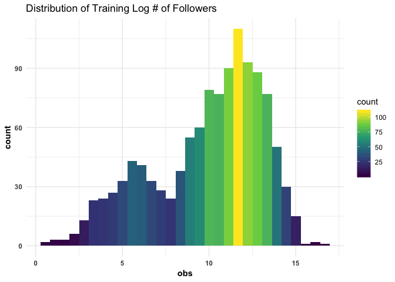<!-- -->

```r
data.frame(obs = test_y) %>% 
  histoPlot(aes(x = obs, fill = ..count..)) + 
  scale_fill_viridis_c(option = "magma") +
  ggtitle("Distribution of Testing Log # of Followers")
```

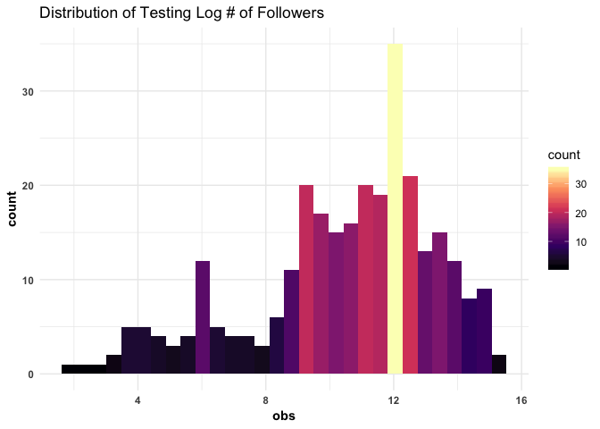<!-- -->

```r
# convert to data matrix for modelling
train_x <- data.matrix(train_x)
test_x <- data.matrix(test_x)
```

Identify most highly correlated predictors with the log # of playlist followers.

```r
high_cor_preds <- train_dat %>% 
  as_tibble() %>% 
  mutate(log_playlist_followers = log(playlist_followers)) %>% 
  select(log_playlist_followers, playlist_num_tracks:tempo_sd_x_duration_ms_sd) %>%
  cor(use = "pairwise.complete.obs") %>%
  # convert to dataframe so we can retrieve the rownames, or predictors
  data.frame() %>%
  rownames_to_column("preds") %>% 
  # select only predictor names and their correlation with log playlist followers
  select(preds, log_playlist_followers) %>%
  # convert to tibble 
  as_tibble() %>%
  arrange(-abs(log_playlist_followers))

high_cor_preds
```

```
## # A tibble: 237 x 2
##    preds                  log_playlist_followers
##    <chr>                                   <dbl>
##  1 log_playlist_followers                  1    
##  2 track_popularity_mean                   0.492
##  3 track_popularity_sd                    -0.260
##  4 energy_sd                              -0.249
##  5 playlist_num_tracks                     0.216
##  6 artist_pop_sd                          -0.189
##  7 acousticness_sd                        -0.186
##  8 valence_sd                             -0.178
##  9 danceability_sd                        -0.142
## 10 speechiness_sd                         -0.129
## # ... with 227 more rows
```

## Baseline Modeling - OLS 

Only popularity and follower means (3).

```r
# only track and popularity means, follower 
pop_train_x <- train_x %>% as_tibble() %>% select(track_popularity_mean, artist_pop_mean, artist_followers_mean)
pop_test_x <- test_x  %>% as_tibble() %>% select(track_popularity_mean, artist_pop_mean, artist_followers_mean)

# fit model
spotify_lm <- lm(data = data.frame(train_y, pop_train_x), train_y ~ . )

summary(spotify_lm)
```

```
## 
## Call:
## lm(formula = train_y ~ ., data = data.frame(train_y, pop_train_x))
## 
## Residuals:
##     Min      1Q  Median      3Q     Max 
## -10.246  -1.394   0.542   1.805   6.308 
## 
## Coefficients:
##                        Estimate Std. Error t value Pr(>|t|)    
## (Intercept)           10.793729   0.514852  20.965  < 2e-16 ***
## track_popularity_mean  0.150005   0.006505  23.061  < 2e-16 ***
## artist_pop_mean       -0.053871   0.012009  -4.486 7.97e-06 ***
## artist_followers_mean -0.273378   0.075261  -3.632 0.000293 ***
## ---
## Signif. codes:  0 '***' 0.001 '**' 0.01 '*' 0.05 '.' 0.1 ' ' 1
## 
## Residual standard error: 2.561 on 1165 degrees of freedom
## Multiple R-squared:  0.3559,	Adjusted R-squared:  0.3543 
## F-statistic: 214.6 on 3 and 1165 DF,  p-value: < 2.2e-16
```

```r
# coefficients
broom::tidy(spotify_lm)
```

```
## # A tibble: 4 x 5
##   term                  estimate std.error statistic  p.value
##   <chr>                    <dbl>     <dbl>     <dbl>    <dbl>
## 1 (Intercept)            10.8      0.515       21.0  4.68e-83
## 2 track_popularity_mean   0.150    0.00650     23.1  3.11e-97
## 3 artist_pop_mean        -0.0539   0.0120      -4.49 7.97e- 6
## 4 artist_followers_mean  -0.273    0.0753      -3.63 2.93e- 4
```

```r
postResample(spotify_lm$fitted.values, obs = train_y)
```

```
##      RMSE  Rsquared       MAE 
## 2.5567104 0.3559442 2.0105193
```

```r
ols_cv_p <- tibble(preds = spotify_lm$fitted.values, obs = train_y) %>%
  scttrCor(aes(x = preds, y = obs), alpha = 0.8) + 
    scale_x_continuous(breaks = seq(0, 17.5, by = 2.5), limits = c(0, 17.5)) + 
  scale_y_continuous(breaks = seq(0, 17.5, by = 2.5), limits = c(0, 17.5)) +
  ggtitle("OLS Model - (Baseline model)") 

ols_cv_p
```

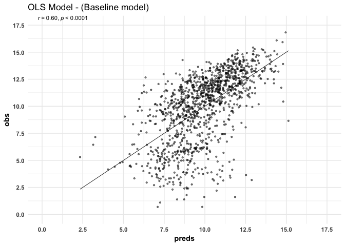<!-- -->


## Random Forest

Let's stick with the model straight out of the box. 

```r
library(randomForest)
set.seed(11-22-1993)
train_rf <- randomForest(y = train_y, 
                         x = train_x, 
                   ntree = 500,
                   importance = TRUE,
                   na.rm = TRUE)
# plot(train_rf)
# train_rf
```

Variable importance is computed as (taken from :https://stats.stackexchange.com/questions/162465/in-a-random-forest-is-larger-incmse-better-or-worse)
1. grow regression forest. Compute OOB-mse, name this mse0.
2. for 1 to j var: permute values of column j, then predict and compute OOB-mse(j)
3. %IncMSE of j'th is (mse(j)-mse0)/mse0 * 100%


```r
rf_imp <- data.frame(importance(train_rf)) %>% rownames_to_column("preds") %>% arrange(desc(X.IncMSE))

ggplot(rf_imp[1:30, ],
       aes(x = reorder(preds, X.IncMSE), y = X.IncMSE, fill = X.IncMSE)) +
  geom_col() + 
  labs(x = 'Variables', y= '% increase MSE if variable is randomly permuted') + 
  coord_flip() + 
  theme(legend.position="none") +
  ggtitle("Random Forest Variable Importance")
```

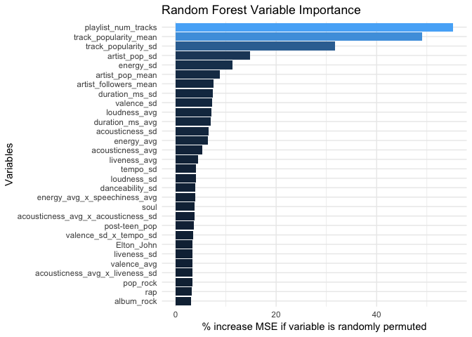<!-- -->

We see that the number of tracks and popularity related features are the most important variables, that is, when these variables are randomly shuffled (permuted), they result in the greatest increase of the test error. As we saw in the EDA, the track popularity is an important variable and thus likely an important characteristic of determining the success of a playlist. We also see that the majority of the top 30 most important variables are summary statistics related to quantitative audio features, with a few genres and one artist.

Model performance


```r
# OOB performance

# which.min(train_rf$mse)
train_rf$rsq[which.min(train_rf$mse)]
```

```
## [1] 0.5477789
```

```r
sqrt(train_rf$mse[which.min(train_rf$mse)])
```

```
## [1] 2.142374
```

```r
# scatter plot of predicted vs observed values

# postResample(train_rf$predicted, train_y) 
rf_cv_p <- tibble(preds = train_rf$predicted, obs = train_y) %>%
  scttrCor(aes(x = preds, y = obs)) + 
    scale_x_continuous(breaks = seq(0, 17.5, by = 2.5), limits = c(0, 17.5)) + 
  scale_y_continuous(breaks = seq(0, 17.5, by = 2.5), limits = c(0, 17.5)) +
  ggtitle("Random Forest Out of Bag Model")

rf_cv_p
```

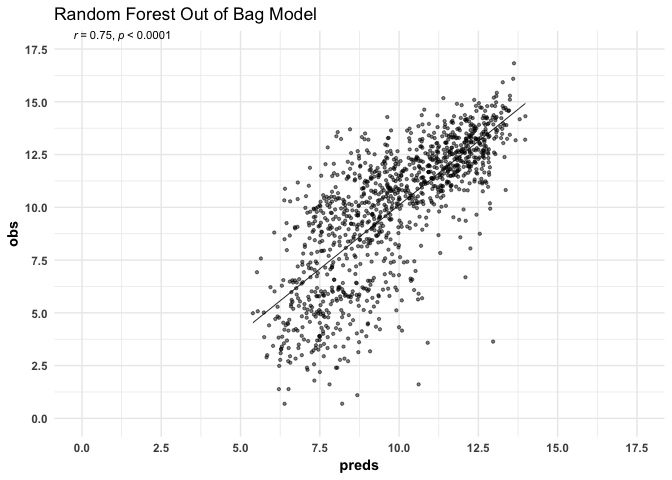<!-- -->


## Regularized Regression

All predictors were normalized (ie. mean = 0 and variance = 1) to allow the penalization scheme to fairly affect all predictors. 

For lasso, I decided to fit the model first using only the mean track and artist popularity, and the mean artist followers. I then add in predictors as follows:

* Quantitative Audio Features (20)
* Top 50 Predictors Correlated with the Log of playlist followers
* Top 50 Predictors + One-Hot Encoded Categorical Audio Features 
* All Predictors


```r
# only track and popularity means, follower 
pop_train_x <- train_x %>%
  as_tibble() %>% 
  select(track_popularity_mean, artist_pop_mean, artist_followers_mean)
pop_test_x <- test_x  %>%
  as_tibble() %>%
  select(track_popularity_mean, artist_pop_mean, artist_followers_mean)

# track and artist popularity 
quant_train_x <- train_x %>% 
  as_tibble() %>%
  select(track_popularity_mean, artist_pop_mean, danceability_avg:duration_ms_sd)
quant_test_x <- test_x %>%
  as_tibble() %>%
  select(track_popularity_mean, artist_pop_mean, danceability_avg:duration_ms_sd)

# only 'highly' correlated predictors
top_cor_train_x <- train_x %>%
  as_tibble() %>% 
  select(high_cor_preds[2:51,]$preds)
top_cor_test_x <- test_x %>%
  as_tibble() %>% 
  select(high_cor_preds[2:51,]$preds)

# highly correlated perdictors and categorical predictors
top_cor_cat_train_x <- train_x %>% 
  as_tibble() %>% 
  select(high_cor_preds[2:51,]$preds, is_major_mode:vapor_soul)
top_cor_cat_test_x <- test_x %>%
  as_tibble() %>% 
  select(high_cor_preds[2:51,]$preds, is_major_mode:vapor_soul)


# fit individually
# lasso_fit_n_summarize(pop_train_x, train_y, pop_test_x, test_y, "TEST") 
# 
# lasso_fit_n_summarize(pop_train_x, train_y, test_y, "TEST") 
# 
# lasso_fit_n_summarize(top_cor_cat_train_x, train_y, test_y, "TEST") 


# fit by iterating through a grid

lasso_list <- list(train = list(pop_train_x, quant_train_x, top_cor_train_x, top_cor_cat_train_x, train_x),
                  test = list( pop_test_x, quant_test_x, top_cor_test_x, top_cor_cat_test_x, test_x),
                  name = list("Popularity and Follower Predictors", "Quantitative Predictors", "Top 50 Predictors", "Top 50 Predictors + Categorical Audio Features", "All Predictors"))


lasso_res <- c(1:5) %>% map_dfr(function(this_function){
  
  names <- lasso_list$name[[this_function]][[1]]
  
  print(paste("Cross-Validating", names))
  test <- lasso_list$test[[this_function]]
  train <- lasso_list$train[[this_function]]
  
 res <-  lasso_fit_n_summarize(training_x = train, train_y, testing_x = test, test_y, names)

})
```

```
## [1] "Cross-Validating Popularity and Follower Predictors"
## [1] "Cross-Validating Quantitative Predictors"
## [1] "Cross-Validating Top 50 Predictors"
## [1] "Cross-Validating Top 50 Predictors + Categorical Audio Features"
## [1] "Cross-Validating All Predictors"
```

```r
lasso_res %>% as_tibble()
```

```
## # A tibble: 5 x 7
##   alpha lambda  RMSE Rsquared   MAE set              type                 
##   <dbl>  <dbl> <dbl>    <dbl> <dbl> <chr>            <chr>                
## 1     1 0.0045  2.56    0.356  2.02 cross-validation Popularity and Follo…
## 2     1 0.0165  2.49    0.388  1.94 cross-validation Quantitative Predict…
## 3     1 0.0435  2.37    0.447  1.81 cross-validation Top 50 Predictors    
## 4     1 0.064   2.33    0.468  1.77 cross-validation Top 50 Predictors + …
## 5     1 0.0745  2.34    0.466  1.78 cross-validation All Predictors
```


Hyper parameter tuning for the best model 'manually', top 50 correlated predictors with the log # of followers + categorical audio features


```r
e.grid <- seq(0.001, 0.1, by = 0.0005)
# e.grid <- 10^seq(10,-2,length=100)

# use 5-fold cv
caret_ctrl <- trainControl(
  method = "cv",
  number = 5,
  verboseIter = FALSE,
  savePredictions = TRUE
)
# set seed for reproducibility
set.seed(1993-11-22)

current_time <- Sys.time()

model_cv <- train(x = top_cor_cat_train_x,
  y = train_y,
  method = "glmnet",
  preProc = c("center", "scale"),
  trControl = caret_ctrl,
  tuneGrid = expand.grid(alpha = c(1), lambda = e.grid)
)
end_time <- Sys.time()

end_time - current_time
```

```
## Time difference of 3.91794 secs
```

Performance metrics.

```r
# model_cv
model_cv$results[model_cv$results$alpha == model_cv$bestTune$alpha & model_cv$results$lambda == model_cv$bestTune$lambda, ]
```

```
## # A tibble: 1 x 8
##   alpha lambda  RMSE Rsquared   MAE RMSESD RsquaredSD MAESD
## * <dbl>  <dbl> <dbl>    <dbl> <dbl>  <dbl>      <dbl> <dbl>
## 1     1  0.064  2.33    0.468  1.77  0.261     0.0779 0.120
```

```r
plot(model_cv)
```

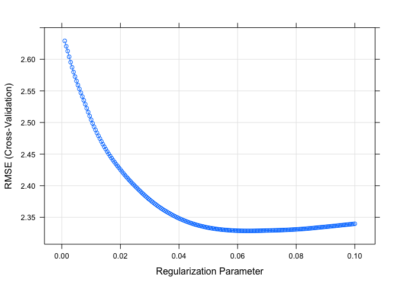<!-- -->

```r
# lasso_varImp$importance[lasso_varImp$importance$Overall > 0]
```


Let's look at variable importance based on absolute coefficients.

```r
coefs <- coef(model_cv$finalModel, model_cv$bestTune$lambda)
model_coefs <- data.frame(preds = rownames(coefs), coefs = coefs[, 1]) %>%
    as_tibble %>% 
    filter(coefs != 0) %>%
    arrange(desc(abs(coefs)))

model_coefs %>% 
  filter(preds != "(Intercept)")   %>% 
  filter(row_number() <= 30) %>% 
  mutate(coefs = abs(coefs)) %>% 
  ggplot(aes(x = reorder(preds, (coefs)), y = (coefs), fill = coefs)) +
    geom_col(show.legend = FALSE) +
    coord_flip() +
    theme_minimal() +
  ggtitle("Lasso - Top 30 Predictors")
```

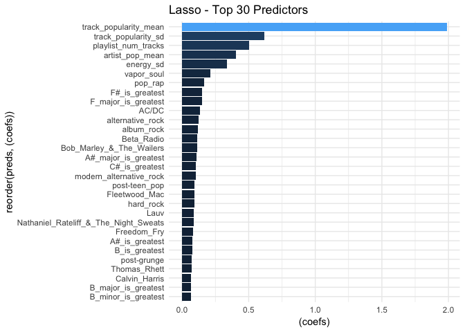<!-- -->

The most important predictors corroborate with what we saw in the EDA, that is, track popularity, the number of tracks, and artist popularity. The remaining predictors are mostly categorical in nature and include key, key mode, along with highly popular genres and artists found in the the most popular playlists. In contrast, random forest had relatively more quantitative audio features.


```r
lasso_cv_p <- model_cv$pred[model_cv$pred$lambda == model_cv$bestTune$lambda & model_cv$pred$alpha == model_cv$bestTune$alpha, ] %>%
  scttrCor(aes(x = pred, y = obs), alpha = 0.8) +
  scale_x_continuous(breaks = seq(0, 17.5, by = 2.5), limits = c(0, 17.5)) + 
  scale_y_continuous(breaks = seq(0, 17.5, by = 2.5), limits = c(0, 17.5)) +
  ggtitle("Lasso Cross-Validation")

lasso_cv_p 
```

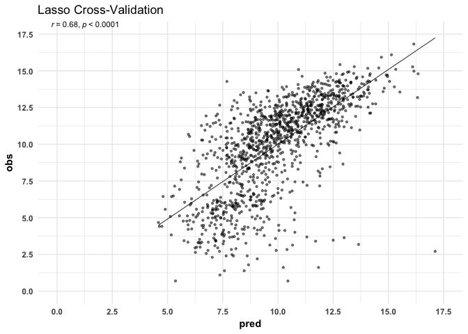<!-- -->


## XGBoost

First, we identify the number of optimal rounds using default values + learning rate of 0.1

```r
library(xgboost)
# https://www.slideshare.net/ShangxuanZhang/winning-data-science-competitions-presented-by-owen-zhang
# https://www.slideshare.net/odsc/owen-zhangopen-sourcetoolsanddscompetitions1
# https://machinelearningmastery.com/configure-gradient-boosting-algorithm/

set.seed(1993-11-22)
# https://www.hackerearth.com/practice/machine-learning/machine-learning-algorithms/beginners-tutorial-on-xgboost-parameter-tuning-r/tutorial/

default_params <- list(objective = "reg:linear",
        booster = "gbtree",
        eta = 0.1, #default = 0.3
        gamma = 0 ,
        max_depth = 6, #default=6
        min_child_weight = 1, #default=1
        subsample = 1,
        colsample_bytree = 1# default = 1
)

xgbcv <- xgb.cv( params = default_params, # for finding optimal number of rounds at default parameters
                 data = train_x, label = train_y,
                 nrounds = 999,
                 nfold = 5, 
                 showsd = T, 
                 stratified = T,
                 print_every_n = 40, 
                 early_stopping_rounds = 20, 
                 maximize = F,
                 seed = (1993-11-22))
```

```
## [1]	train-rmse:8.988836+0.012005	test-rmse:9.016625+0.044410 
## Multiple eval metrics are present. Will use test_rmse for early stopping.
## Will train until test_rmse hasn't improved in 20 rounds.
## 
## [41]	train-rmse:0.596286+0.008715	test-rmse:2.212877+0.157498 
## [81]	train-rmse:0.290187+0.020179	test-rmse:2.193345+0.155267 
## Stopping. Best iteration:
## [87]	train-rmse:0.264033+0.017479	test-rmse:2.191866+0.156439
```

```r
xgbcv$best_iteration  
```

```
## [1] 87
```

```r
# min(xgbcv$test.error.mean)
```
The optimal number of rounds is 87.


Then will identify the best hyperparameter values using 5 fold cross validation with the optimal number of rounds.

```r
xgb_grid = expand.grid( nrounds = xgbcv$best_iteration,
  eta = c(0.1, 0.05, 0.01),
  max_depth = c(2, 3, 4, 5, 6),
  gamma = 0,
  colsample_bytree= 1,
  min_child_weight=c(1, 2, 3, 4 ,5),
  subsample= 1
)

set.seed(1993-11-22)
current_time <- Sys.time()
xgb_caret <- train(x = train_x, y = train_y,
                   method ='xgbTree', 
                   trControl = caret_ctrl,
                   tuneGrid = xgb_grid)
end_time <- Sys.time()

end_time - current_time # 12 minutes

# saveRDS(xgb_caret, "output/xgb_caret.RDS")
```


```r
xgb_caret <- readRDS("output/xgb_caret.RDS")
xgb_caret$bestTune
```

```
## # A tibble: 1 x 7
##   nrounds max_depth   eta gamma colsample_bytree min_child_weight
## *   <int>     <dbl> <dbl> <dbl>            <dbl>            <dbl>
## 1      87         5  0.05     0                1                4
## # ... with 1 more variable: subsample <dbl>
```

```r
xgb_caret$results[xgb_caret$results$eta == 0.05 & xgb_caret$results$max_depth == 5 & xgb_caret$results$colsample_bytree == 1 & xgb_caret$results$min_child_weight == 4,]
```

```
## # A tibble: 1 x 13
##     eta max_depth gamma colsample_bytree min_child_weight subsample
## * <dbl>     <dbl> <dbl>            <dbl>            <dbl>     <dbl>
## 1  0.05         5     0                1                4         1
## # ... with 7 more variables: nrounds <int>, RMSE <dbl>, Rsquared <dbl>,
## #   MAE <dbl>, RMSESD <dbl>, …
```


Previously, we found the best number of rounds, but our model has been trained with more rounds than optimalthus before using it for predictions, we should retrain it to search for the optimal number of rounds again using our tuned hyperparameters. (??)


```r
set.seed(1993-11-22)
# https://www.hackerearth.com/practice/machine-learning/machine-learning-algorithms/beginners-tutorial-on-xgboost-parameter-tuning-r/tutorial/
optimal_params <- list(
        objective = "reg:linear",
        booster = "gbtree",
        eta = 0.05, #default = 0.3
        gamma = 0 ,
        max_depth = 5, #default=6
        min_child_weight = 4, #default=1
        subsample = 1,
        colsample_bytree = 1# default = 1
)

xgbcv <- xgb.cv( params = optimal_params,  # tuned parameters using optimal parameters
                 data = train_x, label = train_y,
                 nrounds = 999,
                 nfold = 5, 
                 showsd = T, 
                 stratified = T,
                 print_every_n = 40, 
                 early_stopping_rounds = 20, 
                 maximize = F,
                 seed = (1993-11-22))
```

```
## [1]	train-rmse:9.463379+0.013363	test-rmse:9.472526+0.052629 
## Multiple eval metrics are present. Will use test_rmse for early stopping.
## Will train until test_rmse hasn't improved in 20 rounds.
## 
## [41]	train-rmse:1.770586+0.013772	test-rmse:2.518183+0.126523 
## [81]	train-rmse:0.894900+0.016195	test-rmse:2.162283+0.144874 
## [121]	train-rmse:0.682624+0.013862	test-rmse:2.147682+0.140346 
## [161]	train-rmse:0.552910+0.013925	test-rmse:2.144740+0.135286 
## Stopping. Best iteration:
## [146]	train-rmse:0.596473+0.013918	test-rmse:2.142114+0.136002
```

```r
xgbcv$best_iteration
```

```
## [1] 146
```

Train the model using the tuned hyperparameters and the optimal number of rounds.

```r
# plot(xgb_caret)
#train the model using the best iteration found by cross validation

xgb_mod <- xgb.train(data = xgb.DMatrix(train_x, label = train_y),
                     params = optimal_params, 
                     nrounds = 146, 
                     seed = (1993-11-22))

xgb_mod
```

```
## ##### xgb.Booster
## Handle is invalid! Suggest using xgb.Booster.complete
## raw: 242.2 Kb 
## call:
##   xgb.train(params = optimal_params, data = xgb.DMatrix(train_x, 
##     label = train_y), nrounds = 146, seed = (1993 - 11 - 22))
## params (as set within xgb.train):
##   objective = "reg:linear", booster = "gbtree", eta = "0.05", gamma = "0", max_depth = "5", min_child_weight = "4", subsample = "1", colsample_bytree = "1", seed = "1960", silent = "1"
## callbacks:
##   cb.print.evaluation(period = print_every_n)
## # of features: 421 
## niter: 146
## nfeatures : 421
```

```r
xgb_best_cv <- as_tibble(xgb_caret$pred[xgb_caret$pred$eta == 0.05 & xgb_caret$pred$max_depth == 5 & xgb_caret$pred$colsample_bytree == 1 & xgb_caret$pred$min_child_weight == 4,])


xg_cv_p <- xgb_best_cv %>% 
  scttrCor(aes(x = pred, y = obs), alpha = 0.7) + 
    scale_x_continuous(breaks = seq(0, 17.5, by = 2.5), limits = c(0, 17.5)) + 
  scale_y_continuous(breaks = seq(0, 17.5, by = 2.5), limits = c(0, 17.5)) +
  ggtitle("XGBoost Cross-Validation")

xg_cv_p
```

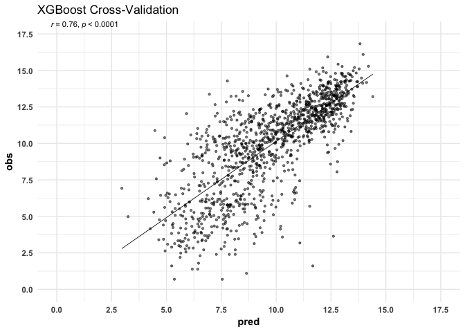<!-- -->

Variable importance


```r
library(Ckmeans.1d.dp)
mat <- xgb.importance (feature_names = colnames(train_x), model = xgb_mod)

xgb.ggplot.importance(importance_matrix = mat[1:30], rel_to_first = TRUE)
```

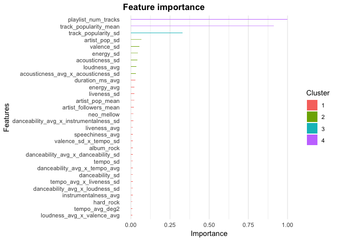<!-- -->


## Comparison of Model Performance Metrics

### Training Data
Based on the training data alone, we can see that the models that best explain the training data are:

4. Ordinary Least Squares
3. Lasso
2. Random Forest
1. XGBoost


```r
# CV Metrics
ols_cv <- postResample(spotify_lm$fitted.values, train_y)
rf_cv <- c("RMSE" = sqrt(train_rf$mse[which.min(train_rf$mse)]), 
           "Rsquared" = train_rf$rsq[which.max(train_rf$rsq)], "MAE" = NA)
lasso_cv <- model_cv$results[model_cv$results$alpha == model_cv$bestTune$alpha & model_cv$results$lambda == model_cv$bestTune$lambda, c(3:5) ]
xgb_cv <- xgb_caret$results[xgb_caret$results$eta == 0.05 & xgb_caret$results$max_depth == 5 & xgb_caret$results$colsample_bytree == 1 & xgb_caret$results$min_child_weight == 4, c(8:10)]


data.frame(ols = round(ols_cv, 3),
          rf = round(rf_cv, 3),
          lasso = round(unlist(lasso_cv), 3),
          xgb = round(unlist(xgb_cv), 3))
```

```
## # A tibble: 3 x 4
##     ols     rf lasso   xgb
## * <dbl>  <dbl> <dbl> <dbl>
## 1 2.56   2.14  2.33  2.08 
## 2 0.356  0.548 0.468 0.576
## 3 2.01  NA     1.77  1.59
```

Scatterplots - visualizing predicted vs observed log # of followers.


```r
ols_cv_p + rf_cv_p + lasso_cv_p + xg_cv_p + plot_layout(nrow = 2)
```

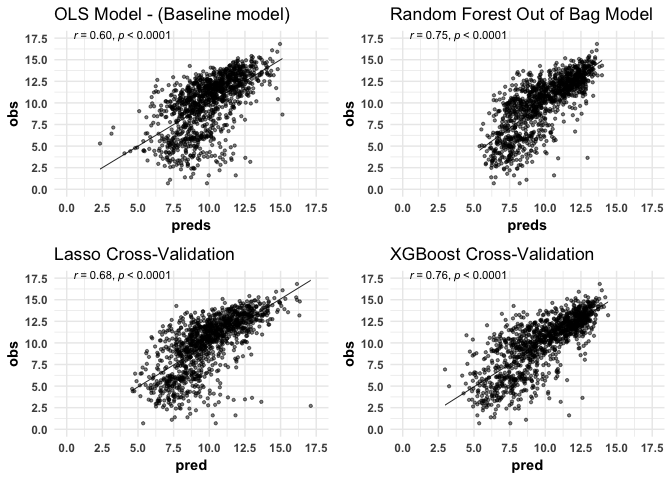<!-- -->


# Validation Using XGBoost


```r
xgb_preds <- predict(xgb_mod, test_x)
postResample(xgb_preds, test_y) 
```

```
##      RMSE  Rsquared       MAE 
## 2.0854239 0.4846405 1.5495922
```

```r
xg_val_p <- tibble(preds = xgb_preds, obs = test_y) %>% 
  scttrCor(aes(x = preds, y = obs)) +
  ggtitle("XGBoost Validation")

xg_val_p
```

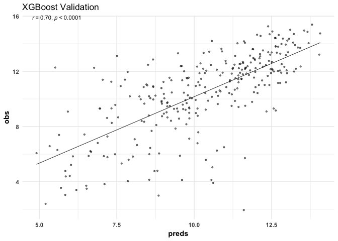<!-- -->


<!-- ### Testing Data -->

<!-- Applying our models to the held-out data, we find that the models that most accurately (based on MAE) predict and explain variation in the log number of followers the best are: -->

<!-- 4. Ordinary Least Squares -->
<!-- 3. Lasso -->
<!-- 2. Random Forest -->
<!-- 1. XGBoost -->


